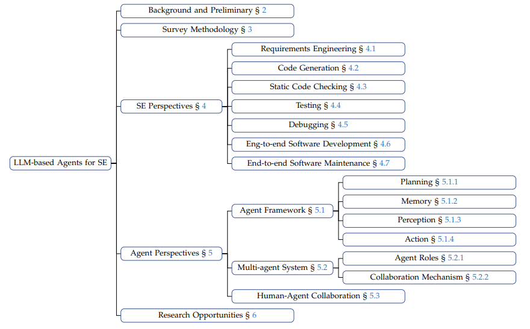
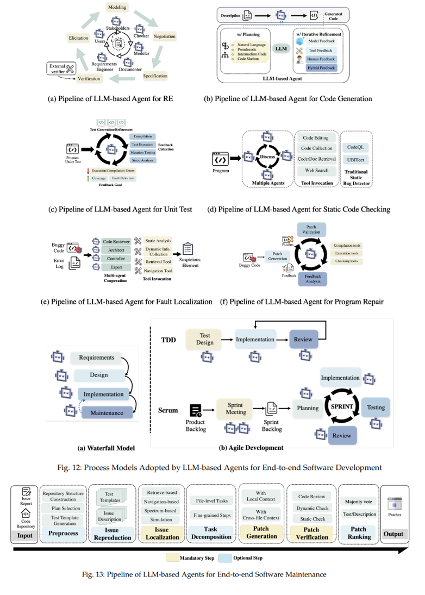
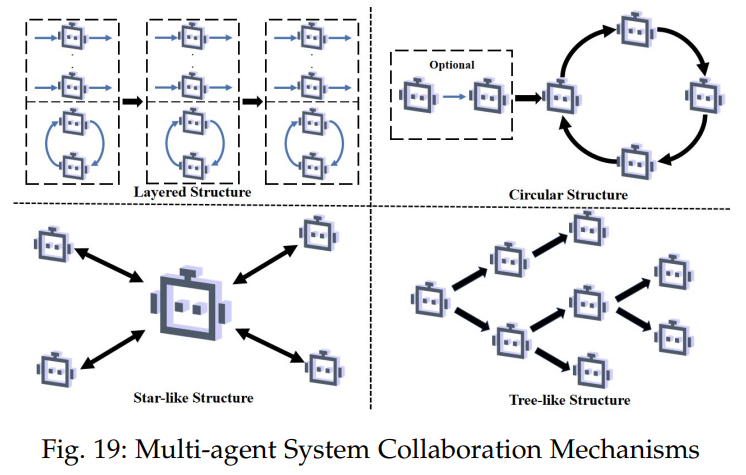
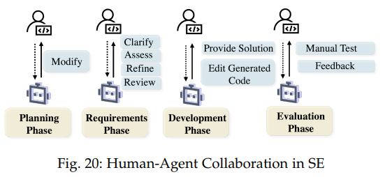

# Large Language Model-Based Agents for Software Engineering: A Survey

<p>
<a href="http://arxiv.org/pdf/2409.02977"></a> 

</p>

The recent advance in Large Language Models (LLMs) has shaped a new paradigm of AI agents, i.e., LLM-based agents. Compared to standalone LLMs, LLM-based agents substantially extend the versatility and expertise of LLMs by enhancing LLMs with the capabilities of perceiving and utilizing external resources and tools. To date, LLM-based agents have been applied and shown remarkable effectiveness in Software Engineering (SE). The synergy between multiple agents and human interaction brings further promise in tackling complex real-world SE problems. In this work, we present a comprehensive and systematic survey on LLM-based agents for SE. We collect 106 papers and categorize them from two perspectives, i.e., the SE and agent perspectives. In addition, we discuss open challenges and future directions in this critical domain.

📍 **We systematically summarized the progress of Agent4SE from the perspectives of both *Software Engineering* tasks and *Agent Architecture*.** 

:page_facing_up: Paper Link: [Large Language Model-Based Agents for Software Engineering: A Survey](http://arxiv.org/pdf/2409.02977)




<br/>	

## :star: Star this repository

This research field is evolving rapidly; star this repository to keep up with the updates!

<br/>

## 📰 News

* **[2024/09/04]**  🎉 We released the first version of our survey on arXiv.

<br/>

## Table of Contents

* 📰 [News](#-news)
* 🖥️ [SE Perspectives](#%EF%B8%8F-se-perspectives)
  * [Requirement Engineering](#requirement-engineering)
  * [Code Generation](#code-generation)
  * [Verification](#verification)
  * [Static Code Checking](#static-checking)
    * [Static Bug Detection](#static-bug-detection)
    * [Code Review](#code-review)
  * [Testing](#testing)
    * [Unit Testing](#unit-testing)
    * [System Testing](#system-testing)
  * [Debugging](#debugging)
    * [Fault Localization](#fault-localization)
    * [Program Repair](#program-repair)
    * [Unified Debugging](#unified-debugging)
  * [Release](#release)
  * [End-to-end Software Development](#end-to-end-software-development)
  * [End-to-end Software Maintenance](#end-to-end-software-maintenance)
* 🤖[Agent Perspectives](#-agent-perspectives)
  * [Agent Framework](#agent-framework)
    * [Planning](#planning)
    * [Memory](#memory)
    * [Perception](#perception)
    * [Action](#action)
  * [Multi-agent System](#multi-agent-system)
    * [Agent Roles](#agent-roles)
    * [Collaboration Mechanism](#collaboration-mechanism)
  * [Human-Agent Collaboration](#human-agent-collaboration)
    * [Planning Phase](#planning-phase)
    * [Requirements Phase](#requirements-phase)
    * [Development Phase](#development-phase)
    * [Evaluation Phase](#evaluation-phase)
* 📝 [Citation](#-citation)
* 👨🏻‍💻 [Maintainers](#-maintainers)
* 📬 [Contact Us](#-contact-us)
* 🌟 [Star History](#-star-history)

<br/>

## 🖥️ SE Perspectives



### Requirement Engineering

* [2024/05] **MARE: Multi-Agents Collaboration Framework for Requirements Engineering.** *Jin et al. arXiv.* [[paper](https://arxiv.org/pdf/2405.03256)]
* [2024/04] **Elicitron: An LLM Agent-Based Simulation Framework for Design Requirements Elicitation.** *Ataei et al. arXiv.* [[paper](https://arxiv.org/pdf/2404.16045)]
* [2024/01] **SpecGen: Automated Generation of Formal Program Specifications via Large Language Models.** *Ma et al. arXiv.* [[paper](https://arxiv.org/pdf/2401.08807)] [[repo](https://sites.google.com/view/specgen)]
* [2023/10] **Advancing Requirements Engineering through Generative AI: Assessing the Role of LLMs.** *Arora et al. arXiv.* [[paper](https://arxiv.org/pdf/2310.13976)]

<br/>

### Code Generation 

* [2024/10] **Multi-Programming Language Sandbox for LLMs** *Dou et al. arXiv* [[paper](https://arxiv.org/pdf/2410.23074)]
* [2024/10] **SceneGenAgent: Precise Industrial Scene Generation with Coding Agent** *Xia et al. arXiv* [[paper](https://arxiv.org/pdf/2410.21909)] [[repo](https://github.com/THUDM/SceneGenAgent)]
* [2024/10] **MCCoder: Streamlining Motion Control with LLM-Assisted Code Generation and Rigorous Verification** *Li et al. arXiv* [[paper](https://arxiv.org/pdf/2410.15154)] [[repo](https://github.com/MCCodeAI/MCCoder)]
* [2024/10] **Agents4PLC: Automating Closed-loop PLC Code Generation and Verification in Industrial Control Systems using LLM-based Agents** *Liu et al. arXiv* [[paper](https://arxiv.org/pdf/2410.14209)] [[repo](https://hotbento.github.io/Agent4PLC/)]
* [2024/10] **Improving Parallel Program Performance Through DSL-Driven Code Generation with LLM Optimizers** *Wei et al. arXiv.* [[paper](https://arxiv.org/pdf/2410.15625)]
* [2024/10] **AgentBank: Towards Generalized LLM Agents via Fine-Tuning on 50000+ Interaction Trajectories** *Song et al. arXiv.* [[paper](https://arxiv.org/pdf/2410.07706)]
* [2024/10] **RLEF: GROUNDING CODE LLMS IN EXECUTION FEEDBACK WITH REINFORCEMENT LEARNING** *Gehring et al. arXiv.* [[paper](https://arxiv.org/pdf/2410.02089)]
* [2024/10] **Better than Your Teacher: LLM Agents that learn from Privileged AI Feedback** *Choudhury et al. arXiv.* [[paper](https://arxiv.org/pdf/2410.05434)]
* [2024/10] **AMR-Evol: Adaptive Modular Response Evolution Elicits Better Knowledge Distillation for Large Language Models in Code Generation** *Luo et al. arXiv.* [[paper](https://arxiv.org/pdf/2410.00558?)] [[repo](https://github.com/ChiYeungLaw/AMR-Evol)]
* [2024/10] **RGD: Multi-LLM Based Agent Debugger via Refinement and Generation Guidance** *Jin et al. arXiv.* [[paper](https://arxiv.org/pdf/2410.01242)]
* [2024/09] **AutoSafeCoder: A Multi-Agent Framework for Securing LLM Code Generation through Static Analysis and Fuzz Testing** *Nunez et al. arXiv* [[paper](https://arxiv.org/pdf/2409.10737)] [[repo](https://github.com/SecureAIAutonomyLab/AutoSafeCoder)]
* [2024/09] **A Pair Programming Framework for Code Generation via Multi-Plan Exploration and Feedback-Driven Refinement** *Zhang et al. arXiv* [[paper](https://arxiv.org/pdf/2409.05001)] [[repo](https://github.com/nju-websoft/PairCoder)]
* [2024/08] **Sifting through the Chaff: On Utilizing Execution Feedback for Ranking the Generated Code Candidates** *Sun et al. arXiv* [[paper](https://arxiv.org/pdf/2408.13976)]
* [2024/08] **CODEXGRAPH: Bridging Large Language Models and Code Repositories via Code Graph Databases** *Liu et al. arXiv.* [[paper](https://arxiv.org/pdf/2408.03910?)] [[repo](https://github.com/modelscope/modelscope-agent/tree/master/apps/codexgraph_agent)]
* [2024/07] **OPENHANDS: AN OPEN PLATFORM FOR AI SOFTWARE DEVELOPERS AS GENERALIST AGENTS** *Wang et al. arXiv* [[paper](https://arxiv.org/pdf/2407.16741)] [[repo](https://github.com/All-Hands-AI/OpenHands)]
* [2024/05] **Class-Level Code Generation from Natural Language Using Iterative, Tool-Enhanced Reasoning over Repository.** *Deshpande et al. arXiv.* [[paper](https://arxiv.org/pdf/2405.01573)]
* [2024/05] **MapCoder: Multi-Agent Code Generation for Competitive Problem Solving.** *Islam et al. ACL.* [[paper](https://arxiv.org/pdf/2405.11403)] [[repo](https://github.com/Md-Ashraful-Pramanik/MapCoder)]
* [2024/05] **AutoCoder: Enhancing Code Large Language Model with AIEV-INSTRUCT.** *Lei et al. arXiv.* [[paper](https://arxiv.org/pdf/2405.14906)] [[repo](https://github.com/bin123apple/AutoCoder)]
* [2024/04] **3DGen: AI-Assisted Generation of Provably Correct Binary Format Parsers**. *Fakhoury et al. arXiv* [[paper](https://arxiv.org/pdf/2404.10362)]
* [2024/04] **Self-Organized Agents: A LLM Multi-Agent Framework toward Ultra Large-Scale Code Generation and Optimization.** *Ishibashi et al. arXiv.* [[paper](https://arxiv.org/pdf/2404.02183)] [[repo](https://github.com/tsukushiAI/self-organized-agent)]
* [2024/03] **AutoDev: Automated AI-Driven Development**. *Tufano et al. arXiv* [[paper](https://arxiv.org/pdf/2403.08299)]
* [2024/03] **CoCoST: Automatic Complex Code Generation with Online Searching and Correctness Testing.** *He et al. arXiv.* [[paper](https://arxiv.org/pdf/2403.13583)]
* [2024/03] **RAT: Retrieval Augmented Thoughts Elicit Context-Aware Reasoning in Long-Horizon Generation**. *Wang et al. arXiv.* [[paper](https://arxiv.org/pdf/2403.05313)] [[repo](https://github.com/CraftJarvis/RAT)]
* [2024/02] **Executable Code Actions Elicit Better LLM Agents.** *Wang et al. ICML.* [[paper](https://arxiv.org/pdf/2402.01030)] [[repo](https://github.com/xingyaoww/code-act)]
* [2024/02] **More Agents Is All You Need.** *Li et al. arXiv.* [[paper](https://arxiv.org/pdf/2402.05120)]
* [2024/02] **Test-Driven Development for Code Generation.** *Mathews et al. arXiv.* [[paper](https://arxiv.org/pdf/2402.13521)] [[repo](https://osf.io/e3jy6/?view_only=bc67e33bebd3435abf5537d56767401d)]
* [2024/02] **LDB: A Large Language Model Debugger via Verifying Runtime Execution Step by Step.** *Zhong et al. arXiv.* [[paper](https://arxiv.org/pdf/2402.16906)] [[repo](https://github.com/FloridSleeves/LLMDebugger)]
* [2024/01] **CodeAgent: Enhancing Code Generation with Tool-Integrated Agent Systems for Real-World Repo-level Coding Challenges.** *Zhang et al. ACL.* [[paper](https://arxiv.org/pdf/2401.07339)]
* [2024/01] **Teaching Code LLMs to Use Autocompletion Tools in Repository-Level Code Generation.** *Wang et al. arXiv.* [[paper](https://arxiv.org/pdf/2401.06391)]
* [2024/01] **Code Generation with AlphaCodium: From Prompt Engineering to Flow Engineering.** *Ridnik et al. arXiv.* [[paper](https://arxiv.org/pdf/2401.08500)] [[repo](https://github.com/Codium-ai/AlphaCodium)]
* [2023/12] **AgentCoder: Multi-Agent-based Code Generation with Iterative Testing and Optimisation.** *Huang et al. arXiv.* [[paper](https://arxiv.org/pdf/2312.13010)]
* [2023/12] **LLM4TDD: Best Practices for Test Driven Development Using Large Language Models.** *Piya et al. arXiv.* [[paper](https://arxiv.org/pdf/2312.04687)] [[repo](https://github.com/SanyogitaPiya/LLM4TDD/tree/main)]
* [2023/11] **INTERVENOR: Prompting the Coding Ability of Large Language Models with the Interactive Chain of Repair.** *Wang et al. ACL.* [[paper](https://arxiv.org/pdf/2311.09868)] [[repo](https://github.com/NEUIR/INTERVENOR)]
* [2023/10] **Dynamic LLM-Agent Network: An LLM-agent Collaboration Framework with Agent Team Optimization.** *Liu et al. arXiv.* [[paper](https://arxiv.org/pdf/2310.02170)] [[repo](https://github.com/SALT-NLP/DyLAN)]
* [2023/10] **Lemur: Harmonizing Natural Language and Code for Language Agents.** *Xu et al. ICLR.* [[paper](https://arxiv.org/pdf/2310.06830)] [[repo](https://github.com/OpenLemur/Lemur)]
* [2023/10] **ClarifyGPT: Empowering LLM-based Code Generation with Intention Clarification.** *Mu et al. arXiv.* [[paper](https://arxiv.org/pdf/2310.10996)] [[repo](https://github.com/ClarifyGPT/ClarifyGPT)]
* [2023/10] **CODECHAIN: TOWARDS MODULAR CODE GENERATION THROUGH CHAIN OF SELF-REVISIONS WITH REPRESENTATIVE SUB-MODULES.** *Le et al. ICLR.* [[paper](https://arxiv.org/pdf/2310.08992)] [[repo](https://github.com/SalesforceAIResearch/CodeChain)]
* [2023/10] **Language Agent Tree Search Unifies Reasoning, Acting, and Planning in Language Models.** *Zhou et al. ICML.* [[paper](https://arxiv.org/pdf/2310.04406v3)] [[repo](https://github.com/lapisrocks/LanguageAgentTreeSearch)]
* [2023/09] **MINT: EVALUATING LLMS IN MULTI-TURN INTERACTION WITH TOOLS AND LANGUAGE FEEDBACK.** *Wang et al. ICLR.* [[paper](https://arxiv.org/pdf/2309.10691)] [[repo](https://xingyaoww.github.io/mint-bench)]
* [2023/09] **Test-Case-Driven Programming Understanding in Large Language Models for Better Code Generation.** *Tian et al. arXiv.* [[paper](https://arxiv.org/pdf/2309.16120)]
* [2023/09] **CodePlan: Repository-level Coding using LLMs and Planning.** *Bairi et al. FSE.* [[paper](https://arxiv.org/pdf/2309.12499)] [[repo](https://aka.ms/CodePlan)]
* [2023/09] **From Misuse to Mastery: Enhancing Code Generation with Knowledge-Driven AI Chaining.** *Ren et al. ASE.* [[paper](https://arxiv.org/pdf/2309.15606)]
* [2023/09] **Parsel🐍: Algorithmic Reasoning with Language Models by Composing Decompositions.** *Zelikman et al. NeurIPS.* [[paper](https://openreview.net/pdf?id=qd9qcbVAwQ)] [[repo](https://github.com/ezelikman/parsel)]
* [2023/08] **AutoGen: Enabling Next-Gen LLM Applications via Multi-Agent Conversation.** *Wu et al. arXiv.* [[paper](https://arxiv.org/pdf/2308.08155)] [[repo](https://github.com/microsoft/autogen)]
* [2023/08] **Gentopia: A Collaborative Platform for Tool-Augmented LLMs.** *Xu et al. EMNLP.* [[paper](https://arxiv.org/pdf/2308.04030)] [[repo](https://github.com/Gentopia-AI/Gentopia)]
* [2023/08] **Flows: Building Blocks of Reasoning and Collaborating AI.** *Josifoski et al. arXiv.* [[paper](https://arxiv.org/pdf/2308.01285)] [[repo](https://github.com/epfl-dlab/cc_flows)]
* [2023/08] **CodeCoT: Tackling Code Syntax Errors in CoT Reasoning for Code Generation.** *Huang et al. arXiv.* [[paper](https://arxiv.org/pdf/2308.08784)]
* [2023/06] **SELFEVOLVE: A Code Evolution Framework via Large Language Models.** *Jiang et al. arXiv.* [[paper](https://arxiv.org/pdf/2306.02907)]
* [2023/06] **InterCode: Standardizing and Benchmarking Interactive Coding with Execution Feedback.** *Yang et al. NeurIPS.* [[paper](https://arxiv.org/pdf/2306.14898)] [[repo](https://intercode-benchmark.github.io/)]
* [2023/06] **IS SELF-REPAIR A SILVER BULLET FOR CODE GENERATION?.** *Olausson et al. ICLR.* [[paper](https://arxiv.org/pdf/2306.09896)] [[repo](https://github.com/theoxo/self-repair)]
* [2023/05] **ToolCoder: Teach Code Generation Models to use API search tools.** *Zhang et al. arXiv.* [[paper](https://arxiv.org/pdf/2305.04032)]
* [2023/05] **Self-Edit: Fault-Aware Code Editor for Code Generation**. *Zhang et al. ACL.* [[paper](https://aclanthology.org/2023.acl-long.45v3.pdf)]
* [2023/04] **Teaching Large Language Models to Self-Debug.** *Chen et al. ICLR.* [[paper](https://arxiv.org/pdf/2304.05128)]
* [2023/04] **Fully Autonomous Programming with Large Language Models.** *Liventsev et al. GECCO.* [[paper](https://dl.acm.org/doi/pdf/10.1145/3583131.3590481)]
* [2023/03] **CAMEL: Communicative Agents for “Mind” Exploration of Large Language Model Society.** *Li et al. NeurIPS.* [[paper](https://arxiv.org/pdf/2303.17760)] [[repo](https://github.com/camel-ai/camel)]
* [2023/03] **Reflexion: Language Agents with Verbal Reinforcement Learning.** *Shinn et al. NeurIPS.* [[paper](https://arxiv.org/pdf/2303.11366)] [[repo](https://github.com/noahshinn024/reflexion)]
* [2023/03] **SELF-REFINE: Iterative Refinement with Self-Feedback.** *Madaan et al. NeurIPS.* [[paper](https://arxiv.org/pdf/2303.17651)] [[repo](https://selfrefine.info/)]

<br/>

### Verification
* [2024/10] **Automated Proof Generation for Rust Code via Self-Evolution** *Chen et al. arXiv* [[paper](https://arxiv.org/pdf/2410.15625)] 
* [2024/09] **AutoVerus: Automated Proof Generation for Rust Code** *Yang et al. arXiv* [[paper](https://arxiv.org/pdf/2409.13082)]

<br/>

### Static Code Checking

#### Static Bug Detection
* [2024/10] **Leveraging Fine-Tuned Language Models for Efficient and Accurate Smart Contract Auditing** *Wei et al. arXiv* [[paper](https://arxiv.org/pdf/2410.13918)] [[repo](https://github.com/LLMSmartAudit/FTSmartAudit)]
* [2024/10] **LLM-SmartAudit: Advanced Smart Contract Vulnerability Detection** *Wei et al. arXiv.* [[paper](https://arxiv.org/pdf/2410.09381)] [[repo](https://github.com/LLMAudit/LLMSmartAuditTool)]
* [2024/05] **LLM-Assisted Static Analysis for Detecting Security Vulnerabilities.** *Li et al. arXiv.* [[paper](https://arxiv.org/pdf/2405.17238)]
* [2024/05] **PropertyGPT: LLM-driven Formal Verification of Smart Contracts through Retrieval-Augmented Property Generation.** *Liu et al. arXiv.* [[paper](https://arxiv.org/pdf/2405.02580)] [[repo](https://sites.google.com/view/propertygpt)]
* [2024/03] **Multi-role Consensus through LLMs Discussions for Vulnerability Detection.** *Mao et al. QRS.* [[paper](https://arxiv.org/pdf/2403.14274)]
* [2024/03] **Combining Fine-tuning and LLM-based Agents for Intuitive Smart Contract Auditing with Justifications.** *Ma et al. arXiv.* [[paper](https://arxiv.org/pdf/2403.16073)] [[repo](https://sites.google.com/view/iaudittool/home)]
* [2024/02] **When Dataflow Analysis Meets Large Language Models.** *Wang et al. arXiv.* [[paper](https://arxiv.org/pdf/2402.10754)]
* [2024/01] **LLM4Vuln: A Unified Evaluation Framework for Decoupling and Enhancing LLMs' Vulnerability Reasoning.** *Sun et al. arXiv.* [[paper](https://arxiv.org/pdf/2401.16185)] [[repo](https://anonymous.4open.science/r/LLM4Vuln/)]
* [2023/12] **E&V: Prompting Large Language Models to Perform Static Analysis by Pseudo-code Execution and Verification.** *Hao et al. arXiv.* [[paper](https://arxiv.org/pdf/2312.08477)]
* [2023/10] **Large Language Model-Powered Smart Contract Vulnerability Detection: New Perspectives.** *Hu et al. TPS-ISA.* [[paper](https://arxiv.org/pdf/2310.01152)] [[repo](https://github.com/git-disl/GPTLens)]
* [2023/10] **Static Code Analysis in the AI Era: An In-depth Exploration of the Concept, Function, and Potential of Intelligent Code Analysis.** *Fan et al. arXiv.* [[paper](https://arxiv.org/pdf/2310.08837)]
* [2023/08] **Enhancing Static Analysis for Practical Bug Detection: An LLM-Integrated Approach.** *Li et al. arXiv.* [[paper](https://dl.acm.org/doi/pdf/10.1145/3649828)] [[repo](https://sites.google.com/view/llift-open/home?authuser=0)]
* [2023/03] **ART: Automatic multi-step reasoning and tool-use for large language models.** *Paranjape et al. arXiv.* [[paper](https://arxiv.org/pdf/2303.09014)] [[repo](https://github.com/bhargaviparanjape/language-programmes/)]

#### Code Review
* [2024/10] **Agent-as-a-Judge: Evaluate Agents with Agents** *Zhuge et al. arXiv.* [[paper](https://arxiv.org/pdf/2410.10934?)] [[repo](https://github.com/metauto-ai/agent-as-a-judge)] 
* [2024/09] **Divide-and-Conquer: Automating Code Revisions via Localization-and-Revision** *Wang et al. ACM Trans. Softw. Eng. Methodol.* [[paper](https://dl.acm.org/doi/pdf/10.1145/3697013)]
* [2024/04] **AI-powered Code Review with LLMs: Early Results.** *Rasheed et al. arXiv.* [[paper](https://arxiv.org/pdf/2404.18496)]
* [2024/02] **CodeAgent: Collaborative Agents for Software Engineering.** *Tang et al. arXiv.* [[paper](https://arxiv.org/pdf/2402.02172.pdf)] [[repo](https://github.com/Code4Agent/codeagent)]
* [2023/10] **Static Code Analysis in the AI Era: An In-depth Exploration of the Concept, Function, and Potential of Intelligent Code Analysis.** *Fan et al. arXiv.* [[paper](https://arxiv.org/pdf/2310.08837)]
* [2023/09] **CORE: Resolving Code Quality Issues using LLMs.** *Wadhwa et al. FSE.* [[paper](https://dl.acm.org/doi/pdf/10.1145/3643762)] [[repo](http://aka.ms/COREMSRI)]

<br/>

### Testing

#### Unit Testing

* [2024/11] **ReAccept: Automated Co-evolution of Production and Test Code Based on Dynamic Validation and Large Language Models** *Chi et al. arXiv* [[paper](https://arxiv.org/pdf/2411.11033)] [[repo](https://github.com/Timiyang-ai/REACCEPT.git)]
* [2024/09] **Python Symbolic Execution with LLM-powered Code Generation** *Wang et al. arXiv* [[paper](https://arxiv.org/pdf/2409.09271)]
* [2024/06] **Mokav: Execution-driven Differential Testing with LLMs.** *Etemadi et al. arXiv.* [[paper](https://arxiv.org/pdf/2406.10375)] [[repo](https://github.com/ASSERT-KTH/Mokav)]
* [2024/04] **Enhancing LLM-based Test Generation for Hard-to-Cover Branches via Program Analysis.** *Yang et al. arXiv.* [[paper](https://arxiv.org/pdf/2404.04966)]
* [2024/03] **AutoDev: Automated AI-Driven Development**. *Tufano et al. arXiv* [[paper](https://arxiv.org/pdf/2403.08299)]
* [2024/03] **COVERUP: Coverage-Guided LLM-Based Test Generation.** *Pizzorno et al. arXiv.* [[paper](https://arxiv.org/pdf/2403.16218)] [[repo](https://github.com/plasma-umass/coverup)]
* [2023/08] **Effective Test Generation Using Pre-trained Large Language Models and Mutation Testing.** *Dakhel et al. Inf. Softw. Technol. .* [[paper](https://arxiv.org/pdf/2308.16557)] [[repo](https://github.com/ExpertiseModel/MuTAP)]
* [2023/05] **No More Manual Tests? Evaluating and Improving ChatGPT for Unit Test Generation.** *Yuan et al. arXiv.* [[paper](https://arxiv.org/pdf/2305.04207)] [[repo](https://github.com/FudanSELab/ChatTester/tree/main)]
* [2023/05] **ChatUniTest: A Framework for LLM-Based Test Generation.** *Chen et al. FSE.* [[paper](https://arxiv.org/pdf/2305.04764)] [[repo](https://github.com/ZJU-ACES-ISE/ChatUniTest)]
* [2023/02] **An Empirical Evaluation of Using Large Language Models for Automated Unit Test Generation.** *Schäfer et al. IEEE Trans. Software Eng..* [[paper](https://arxiv.org/pdf/2302.06527)] [[repo](https://doi.org/10.6084/m9.figshare.23653371)]

#### System Testing

* [2024/11] **A Code Knowledge Graph-Enhanced System for LLM-Based Fuzz Driver Generation** *Xu et al. arXiv.* [[paper](https://arxiv.org/pdf/2411.11532)]
* [2024/07] **Vision-driven Automated Mobile GUI Testing via Multimodal Large Language Model.** *Liu et al. arXiv.* [[paper](https://arxiv.org/pdf/2407.03037)] [[repo](https://github.com/testtestA6/VisionDroid)]
* [2024/04] **LLM Agents can Autonomously Exploit One-day Vulnerabilities.** *Fang et al. arXiv.* [[paper](https://arxiv.org/pdf/2404.08144)]
* [2024/02] **You Can REST Now: Automated Specification Inference and Black-Box Testing of RESTful APIs with Large Language Models.** *Decrop et al. arXiv.* [[paper](https://arxiv.org/pdf/2402.05102)] [[repo](https://doi.org/10.5281/zenodo.10377255)]
* [2024/01] **XUAT-Copilot: Multi-Agent Collaborative System for Automated User Acceptance Testing with Large Language Model.** *Wang et al. arXiv.* [[paper](https://arxiv.org/pdf/2401.02705)]
* [2024/01] **KernelGPT: Enhanced Kernel Fuzzing via Large Language Models.** *Yang et al. arXiv.* [[paper](https://arxiv.org/pdf/2401.00563)]
* [2023/11] **Intent-Driven Mobile GUI Testing with Autonomous Large Language Model Agents**. *Yoon et al. ICST.* [[paper](https://ieeexplore.ieee.org/abstract/document/10638557)] [[repo](https://github.com/testing-agent/droidagent)]
* [2023/10] **Make LLM a Testing Expert: Bringing Human-like Interaction to Mobile GUI Testing via Functionality-aware Decisions.** *Liu et al. ICSE.* [[paper](https://arxiv.org/pdf/2310.15780)]
* [2023/10] **AXNav: Replaying Accessibility Tests from Natural Language.** *Taeb et al. CHI.* [[paper](https://arxiv.org/pdf/2310.02424)]
* [2023/10] **White-box Compiler Fuzzing Empowered by Large Language Models.** *Yang et al. arXiv.* [[paper](https://arxiv.org/pdf/2310.15991)] [[repo](https://github.com/ise-uiuc/WhiteFox)]
* [2023/10] **Testing the Limits: Unusual Text Inputs Generation for Mobile App Crash Detection with Large Language Model.** *Liu et al. ICSE.* [[paper](https://dl.acm.org/doi/pdf/10.1145/3597503.3639118)] [[repo](https://github.com/franklinbill/InputBlaster)]
* [2023/08] **PENTESTGPT: An LLM-empowered Automatic Penetration Testing Tool.** *Deng et al. arXiv.* [[paper](https://arxiv.org/pdf/2308.06782)] [[repo](https://github.com/GreyDGL/PentestGPT)]
* [2023/08] **Fuzz4All: Universal Fuzzing with Large Language Models.** *Xia et al. ICSE.* [[paper](https://arxiv.org/pdf/2308.04748)] [[repo](https://github.com/fuzz4all/fuzz4all)]
* [2023/07] **Isolating Compiler Bugs by Generating Effective Witness Programs with Large Language Models.** *Tu et al. IEEE Trans. Software Eng.* [[paper](https://arxiv.org/pdf/2307.00593)] [[repo](https://github.com/haoxintu/LLM4CBI)]
* [2023/06] **Prompting Is All You Need: Automated Android Bug Replay with Large Language Models.** *Feng et al. ICSE.* [[paper](https://arxiv.org/pdf/2306.01987)] [[repo](https://github.com/sidongfeng/AdbGPT)]

<br/>

### Debugging

#### Fault Localization
* [2024/09] **Enhancing Fault Localization Through Ordered Code Analysis with LLM Agents and Self-Reflection** *Rafi et al. arXiv* [[paper](https://arxiv.org/pdf/2409.13642)]
* [2024/03] **AGENTFL: Scaling LLM-based Fault Localization to Project-Level Context.** *Qin et al. arXiv.* [[paper](https://arxiv.org/pdf/2403.16362)]
* [2023/10] **RCAgent: Cloud Root Cause Analysis by Autonomous Agents with Tool-Augmented Large Language Models.** *Wang et al. arXiv.* [[paper](https://arxiv.org/pdf/2310.16340)]
* [2023/08] **A Quantitative and Qualitative Evaluation of LLM-Based Explainable Fault Localization**. *Kang et al. FSE.* [[paper](https://dl.acm.org/doi/pdf/10.1145/3660771)]

#### Program Repair

* [2024/07] **OPENHANDS: AN OPEN PLATFORM FOR AI SOFTWARE DEVELOPERS AS GENERALIST AGENTS** *Wang et al. arXiv* [[paper](https://arxiv.org/pdf/2407.16741)] [[repo](https://github.com/All-Hands-AI/OpenHands)]
* [2024/10] **Semantic-guided Search for Efficient Program Repair with Large Language Models** *Thanh et al. arXiv* [[paper](https://arxiv.org/pdf/2410.16655)]
* [2024/09] **Neurosymbolic Repair of Test Flakiness**. *Chen et al. ISSTA.* [[paper](https://dl.acm.org/doi/pdf/10.1145/3650212.3680369)]
* [2024/04] **How Far Can We Go with Practical Function-Level Program Repair?.** *Xiang et al. arXiv.* [[paper](https://arxiv.org/pdf/2404.12833)] [[repo](https://github.com/GhabiX/SRepair)]
* [2024/03] **RepairAgent: An Autonomous, LLM-Based Agent for Program Repair.** *Bouzenia et al. arXiv.* [[paper](https://arxiv.org/pdf/2403.17134)]
* [2024/03] **ACFIX: Guiding LLMs with Mined Common RBAC Practices for Context-Aware Repair of Access Control Vulnerabilities in Smart Contracts.** *Zhang et al. arXiv.* [[paper](https://arxiv.org/pdf/2403.06838)]
* [2024/02] **CigaR: Cost-efficient Program Repair with LLMs.** *Hidvégi et al. arXiv.* [[paper](https://arxiv.org/pdf/2402.06598)] [[repo](https://github.com/ASSERT-KTH/cigar)]
* [2023/04] **Explainable Automated Debugging via Large Language Model-driven Scientific Debugging.** *Kang et al. arXiv.* [[paper](https://arxiv.org/pdf/2304.02195)]
* [2023/04] **Keep the Conversation Going: Fixing 162 out of 337 bugs for $0.42 each using ChatGPT.** *Xia et al. arXiv.* [[paper](https://arxiv.org/pdf/2304.00385)]
* [2023/01] **Conversational Automated Program Repair.** *Xia et al. arXiv.* [[paper](https://arxiv.org/pdf/2301.13246)]

#### Unified Debugging

* [2024/04] **A Unified Debugging Approach via LLM-Based Multi-Agent Synergy.** *Lee et al. arXiv.* [[paper](https://arxiv.org/pdf/2404.17153)] [[repo](https://github.com/afortunado-aceptado/Rudra)]
* [2024/02] **LDB: A Large Language Model Debugger via Verifying Runtime Execution Step by Step.** *Zhong et al. arXiv.* [[paper](https://arxiv.org/pdf/2402.16906)] [[repo](https://github.com/FloridSleeves/LLMDebugger)]

<br/>

### Release
* [2024/08] **GoNoGo: An Efficient LLM-based Multi-Agent System for Streamlining Automotive Software Release Decision-Making** *Khoee et al. arXiv* [[paper](https://arxiv.org/pdf/2408.09785)]

<br/>

### End-to-end Software Development

* [2024/09] **Generating Java code pairing with ChatGPT** *Zhao et al. Theoretical Computer Science* [[paper](https://www.sciencedirect.com/science/article/pii/S0304397524004961)] 
* [2024/06] **Experimenting with Multi-Agent Software Development: Towards a Unified Platform** *Sami et al. arXiv.* [[paper](https://arxiv.org/pdf/2406.05381)]
* [2024/06] **Scaling Large-Language-Model-based Multi-Agent Collaboration** *Qian et al. arXiv.* [[paper](https://arxiv.org/pdf/2406.07155)] [[repo](https://github.com/OpenBMB/ChatDev)]
* [2024/06] **Multi-Agent Software Development through Cross-Team Collaboration.** *Du et al. arXiv.* [[paper](https://arxiv.org/pdf/2406.08979)] [[repo](https://github.com/OpenBMB/ChatDev)]
* [2024/06] **AgileCoder: Dynamic Collaborative Agents for Software Development based on Agile Methodology.** *Nguyen et al. arXiv.* [[paper](https://arxiv.org/pdf/2406.11912)] [[repo](https://github.com/FSoft-AI4Code/AgileCoder)]
* [2024/05] **Iterative Experience Refinement of Software-Developing Agents.** *Qian et al. arXiv.* [[paper](https://arxiv.org/pdf/2405.04219)]
* [2024/03] **When LLM-based Code Generation Meets the Software Development Process.** *Lin et al. arXiv.* [[paper](https://arxiv.org/pdf/2403.15852)] [[repo](https://anonymous.4open.science/r/FlowGen-LLM-E842)]
* [2024/03] **CodeS: Natural Language to Code Repository via Multi-Layer Sketch.** *Zan et al. arXiv.* [[paper](https://arxiv.org/pdf/2403.16443)] [[repo](https://github.com/NL2Code/CodeS)]
* [2024/02] **CodePori: Large Scale Model for Autonomous Software Development by Using Multi-Agents.** *Rasheed et al. arXiv.* [[paper](https://arxiv.org/pdf/2402.01411)]
* [2024/01] **Experimenting a New Programming Practice with LLMs.** *Zhang et al. arXiv.* [[paper](https://arxiv.org/pdf/2401.01062)] [[repo](https://drive.google.com/drive/folders/1i0UWqy1K4WwaCLnb7yhyQfV8UqjdXSkl?usp=sharing)]
* [2024/01] **LLM4PLC: Harnessing Large Language Models for Verifiable Programming of PLCs in Industrial Control Systems.** *Fakih et al. ICSE.* [[paper](https://arxiv.org/pdf/2401.05443)] [[repo](https://sites.google.com/uci.edu/llm4plc/home)]
* [2023/12] **Experiential Co-Learning of Software-Developing Agents.** *Qian et al. ACL.* [[paper](https://arxiv.org/pdf/2312.17025)] [[repo](https://github.com/OpenBMB/ChatDev)]
* [2023/11] **Autonomous Agents in Software Development: A Vision Paper** *Rasheed et al. arXiv.* [[paper](https://arxiv.org/pdf/2311.18440)]
* [2023/09] **AutoAgents: A Framework for Automatic Agent Generation.** *Chen et al. arXiv.* [[paper](https://arxiv.org/pdf/2309.17288)] [[repo](https://github.com/Link-AGI/AutoAgents)]
* [2023/08] **AgentVerse: Facilitating Multi-Agent Collaboration and Exploring Emergent Behaviors.** *Chen et al. ICLR.* [[paper](https://arxiv.org/pdf/2308.10848)] [[repo](https://github.com/OpenBMB/AgentVerse/)]
* [2023/08] **METAGPT: META PROGRAMMING FOR A MULTI-AGENT COLLABORATIVE FRAMEWORK.** *Hong et al. ICLR.* [[paper](https://arxiv.org/pdf/2308.00352)] [[repo](https://github.com/geekan/MetaGPT)]
* [2023/07] **Communicative Agents for Software Development.** *Qian et al. ACL.* [[paper](https://arxiv.org/pdf/2307.07924)] [[repo](https://github.com/OpenBMB/ChatDev)]
* [2023/06] **MULTI-AGENT COLLABORATION: HARNESSING THE POWER OF INTELLIGENT LLM AGENTS.** *Talebirad et al. arXiv.* [[paper](https://arxiv.org/pdf/2306.03314)]
* [2023/06] **Prompt Sapper: LLM-Empowered Software Engineering Infrastructure for AI-Native Services.** *Xing et al. arXiv.* [[paper](https://arxiv.org/pdf/2306.02230)]
* [2023/04] **Self-collaboration Code Generation via ChatGPT.** *Dong et al. arXiv.* [[paper](https://arxiv.org/pdf/2304.07590)] [[repo](https://github.com/YihongDong/Self-collaboration-Code-Generation)]
* [2023/04] **Low-code LLM: Visual Programming over LLMs.** *Cai et al. arXiv.* [[paper](https://arxiv.org/pdf/2304.08103v3)] [[repo](https://github.com/chenfei-wu/TaskMatrix/tree/main/LowCodeLLM)]

<br/>

### End-to-end Software Maintenance
* [2024/11] **Lingma SWE-GPT: An Open Development-Process-Centric Language Model for Automated Software Improvement** *Ma et al. arXiv* [[paper](https://arxiv.org/pdf/2411.00622)] [[repo](https://github.com/LingmaTongyi/Lingma-SWE-GPT)]
* [2024/10] **RepoGraph: Enhancing AI Software Engineering with Repository-level Code Graph** *Ouyang et al. arXiv* [[paper](https://arxiv.org/pdf/2410.14684)] [[repo](https://github.com/ozyyshr/RepoGraph)]
* [2024/09] **MarsCode Agent: AI-native Automated Bug Fixing** *Liu et al. arXiv.* [[paper](https://arxiv.org/pdf/2409.00899)] 
* [2024/08] **CODEXGRAPH: Bridging Large Language Models and Code Repositories via Code Graph Databases** *Liu et al. arXiv.* [[paper](https://arxiv.org/pdf/2408.03910?)] [[repo](https://github.com/modelscope/modelscope-agent/tree/master/apps/codexgraph_agent)]
* [2024/08] **DIVERSITY EMPOWERS INTELLIGENCE:INTEGRAT-ING EXPERTISE OF SOFTWARE ENGINEERING AGENTS** *Zhang et al. arXiv.* [[paper](https://arxiv.org/pdf/2408.07060 )]
* [2024/08] **SpecRover: Code Intent Extraction via LLMs** *Ruan et al. arXiv.* [[paper](https://arxiv.org/pdf/2408.02232)] [[repo](https://autocoderover.dev/)]
* [2024/07] **OPENHANDS: AN OPEN PLATFORM FOR AI SOFTWARE DEVELOPERS AS GENERALIST AGENTS** *Wang et al. arXiv* [[paper](https://arxiv.org/pdf/2407.16741)] [[repo](https://github.com/All-Hands-AI/OpenHands)]
* [2024/07] **Agentless: Demystifying LLM-based Software Engineering Agents.** *Xia et al. arXiv.* [[paper](https://arxiv.org/pdf/2407.01489)] [[repo](https://github.com/OpenAutoCoder/Agentless)]
* [2024/06] **How to Understand Whole Software Repository?.** *Ma et al. arXiv.* [[paper](https://arxiv.org/pdf/2406.01422)] [[repo](https://github.com/RepoUnderstander/RepoUnderstander)]
* [2024/06] **CODER: ISSUE RESOLVING WITH MULTI-AGENT AND TASK GRAPHS.** *Chen et al. arXiv.* [[paper](https://arxiv.org/pdf/2406.01304)] [[repo](https://github.com/NL2Code/CodeR)]
* [2024/06] **MASAI: Modular Architecture for Software-engineering AI Agents.** *Arora et al. arXiv.* [[paper](https://arxiv.org/pdf/2406.11638)]
* [2024/05] **SWE-AGENT: AGENT-COMPUTER INTERFACES ENABLE AUTOMATED SOFTWARE ENGINEERING.** *Yang et al. arXiv.* [[paper](https://arxiv.org/pdf/2405.15793)] [[repo](https://swe-agent.com/)]
* [2024/04] **AutoCodeRover: Autonomous Program Improvement.** *Zhang et al. ISSTA.* [[paper](https://dl.acm.org/doi/pdf/10.1145/3650212.3680384)] [[repo](https://github.com/nus-apr/auto-code-rover)]
* [2024/03] **MAGIS: LLM-Based Multi-Agent Framework for GitHub Issue ReSolution.** *Tao et al. arXiv.* [[paper](https://arxiv.org/pdf/2403.17927)]

**Benchmark**
* [2024/10] **SWE-Bench+: Enhanced Coding Benchmark for LLMs** *Aleithan et al. arXiv.* [[paper](https://arxiv.org/pdf/2410.06992)]
* [2024/10] **SWE-bench Multimodal: Do AI Systems Generalize to Visual Software Domains?** *Yang et al. arXiv.* [[paper](https://arxiv.org/pdf/2410.03859)] [[repo](https://www.swebench.com/multimodal)]
* [2024/08] **SWE-bench-java: A GitHub Issue Resolving Benchmark for Java** *Zan et al. arXiv* [[paper](https://arxiv.org/pdf/2408.14354)] [[repo](https://github.com/multi-swe-bench/multi-swe-bench-env)]
* [2024/07] **Agentless: Demystifying LLM-based Software Engineering Agents.** *Xia et al. arXiv.* [[paper](https://arxiv.org/pdf/2407.01489)] [[repo](https://github.com/OpenAutoCoder/Agentless)]
* [2023/10] **Swe-bench: Can language models resolve real-world github issues?** *Jimenez et al. ICLR* [[paper](https://arxiv.org/pdf/2310.06770)] [[repo](https://www.swebench.com)]

<br/>

## 🤖 Agent Perspectives

### Agent Framework

#### Planning

**Single-turn Planning**

* [2024/06] **AgileCoder: Dynamic Collaborative Agents for Software Development based on Agile Methodology.** *Nguyen et al. arXiv.* [[paper](https://arxiv.org/pdf/2406.11912)] [[repo](https://github.com/FSoft-AI4Code/AgileCoder)]
* [2024/06] **Multi-Agent Software Development through Cross-Team Collaboration.** *Du et al. arXiv.* [[paper](https://arxiv.org/pdf/2406.08979)] [[repo](https://github.com/OpenBMB/ChatDev)]
* [2024/05] **MapCoder: Multi-Agent Code Generation for Competitive Problem Solving.** *Islam et al. ACL.* [[paper](https://arxiv.org/pdf/2405.11403)] [[repo](https://github.com/Md-Ashraful-Pramanik/MapCoder)]
* [2024/03] **MAGIS: LLM-Based Multi-Agent Framework for GitHub Issue ReSolution.** *Tao et al. arXiv.* [[paper](https://arxiv.org/pdf/2403.17927)]
* [2024/03] **CodeS: Natural Language to Code Repository via Multi-Layer Sketch.** *Zan et al. arXiv.* [[paper](https://arxiv.org/pdf/2403.16443)] [[repo](https://github.com/NL2Code/CodeS)]
* [2024/03] **CoCoST: Automatic Complex Code Generation with Online Searching and Correctness Testing.** *He et al. arXiv.* [[paper](https://arxiv.org/pdf/2403.13583)]
* [2024/02] **CodePori: Large Scale Model for Autonomous Software Development by Using Multi-Agents.** *Rasheed et al. arXiv.* [[paper](https://arxiv.org/pdf/2402.01411)]
* [2024/01] **CodeAgent: Enhancing Code Generation with Tool-Integrated Agent Systems for Real-World Repo-level Coding Challenges.** *Zhang et al. ACL.* [[paper](https://arxiv.org/pdf/2401.07339)]
* [2024/01] **LLM4PLC: Harnessing Large Language Models for Verifiable Programming of PLCs in Industrial Control Systems.** *Fakih et al. ICSE.* [[paper](https://arxiv.org/pdf/2401.05443)] [[repo](https://sites.google.com/uci.edu/llm4plc/home)]
* [2024/01] **Experimenting a New Programming Practice with LLMs.** *Zhang et al. arXiv.* [[paper](https://arxiv.org/pdf/2401.01062)] [[repo](https://drive.google.com/drive/folders/1i0UWqy1K4WwaCLnb7yhyQfV8UqjdXSkl?usp=sharing)]
* [2023/11] **Autonomous Agents in Software Development: A Vision Paper** *Rasheed et al. arXiv.* [[paper](https://arxiv.org/pdf/2311.18440)]
* [2023/10] **Static Code Analysis in the AI Era: An In-depth Exploration of the Concept, Function, and Potential of Intelligent Code Analysis.** *Fan et al. arXiv.* [[paper](https://arxiv.org/pdf/2310.08837)]
* [2023/09] **Parsel🐍: Algorithmic Reasoning with Language Models by Composing Decompositions.** *Zelikman et al. NeurIPS.* [[paper](https://openreview.net/pdf?id=qd9qcbVAwQ)] [[repo](https://github.com/ezelikman/parsel)]
* [2023/08] **PENTESTGPT: An LLM-empowered Automatic Penetration Testing Tool.** *Deng et al. arXiv.* [[paper](https://arxiv.org/pdf/2308.06782)] [[repo](https://github.com/GreyDGL/PentestGPT)]
* [2023/08] **Flows: Building Blocks of Reasoning and Collaborating AI.** *Josifoski et al. arXiv.* [[paper](https://arxiv.org/pdf/2308.01285)] [[repo](https://github.com/epfl-dlab/cc_flows)]
* [2023/08] **METAGPT: META PROGRAMMING FOR A MULTI-AGENT COLLABORATIVE FRAMEWORK.** *Hong et al. ICLR.* [[paper](https://arxiv.org/pdf/2308.00352)] [[repo](https://github.com/geekan/MetaGPT)]
* [2023/07] **Communicative Agents for Software Development.** *Qian et al. ACL.* [[paper](https://arxiv.org/pdf/2307.07924)] [[repo](https://github.com/OpenBMB/ChatDev)]
* [2023/04] **Self-collaboration Code Generation via ChatGPT.** *Dong et al. arXiv.* [[paper](https://arxiv.org/pdf/2304.07590)] [[repo](https://github.com/YihongDong/Self-collaboration-Code-Generation)]
* [2023/04] **Low-code LLM: Visual Programming over LLMs.** *Cai et al. arXiv.* [[paper](https://arxiv.org/pdf/2304.08103v3)] [[repo](https://github.com/chenfei-wu/TaskMatrix/tree/main/LowCodeLLM)]

**Multi-turn Planning**

* [2024/03] **RAT: Retrieval Augmented Thoughts Elicit Context-Aware Reasoning in Long-Horizon Generation**. *Wang et al. arXiv.* [[paper](https://arxiv.org/pdf/2403.05313)] [[repo](https://github.com/CraftJarvis/RAT)]

*React-like*

* [2024/06] **MASAI: Modular Architecture for Software-engineering AI Agents.** *Arora et al. arXiv.* [[paper](https://arxiv.org/pdf/2406.11638)]
* [2024/02] **Executable Code Actions Elicit Better LLM Agents.** *Wang et al. ICML.* [[paper](https://arxiv.org/pdf/2402.01030)] [[repo](https://github.com/xingyaoww/code-act)]
* [2024/01] **CodeAgent: Enhancing Code Generation with Tool-Integrated Agent Systems for Real-World Repo-level Coding Challenges.** *Zhang et al. ACL.* [[paper](https://arxiv.org/pdf/2401.07339)]
* [2024/01] **XUAT-Copilot: Multi-Agent Collaborative System for Automated User Acceptance Testing with Large Language Model.** *Wang et al. arXiv.* [[paper](https://arxiv.org/pdf/2401.02705)]
* [2023/11] **Intent-Driven Mobile GUI Testing with Autonomous Large Language Model Agents**. *Yoon et al. ICST.* [[paper](https://ieeexplore.ieee.org/abstract/document/10638557)] [[repo](https://github.com/testing-agent/droidagent)]
* [2023/10] **RCAgent: Cloud Root Cause Analysis by Autonomous Agents with Tool-Augmented Large Language Models.** *Wang et al. arXiv.* [[paper](https://arxiv.org/pdf/2310.16340)]
* [2023/10] **Language Agent Tree Search Unifies Reasoning, Acting, and Planning in Language Models.** *Zhou et al. ICML.* [[paper](https://arxiv.org/pdf/2310.04406v3)] [[repo](https://github.com/lapisrocks/LanguageAgentTreeSearch)]
* [2023/10] **AXNav: Replaying Accessibility Tests from Natural Language.** *Taeb et al. CHI.* [[paper](https://arxiv.org/pdf/2310.02424)]
* [2023/09] **CodePlan: Repository-level Coding using LLMs and Planning.** *Bairi et al. FSE.* [[paper](https://arxiv.org/pdf/2309.12499)] [[repo](https://aka.ms/CodePlan)]

*Layered*

* [2024/04] **Self-Organized Agents: A LLM Multi-Agent Framework toward Ultra Large-Scale Code Generation and Optimization.** *Ishibashi et al. arXiv.* [[paper](https://arxiv.org/pdf/2404.02183)] [[repo](https://github.com/tsukushiAI/self-organized-agent)]

<br>

#### Memory

**Long-term Memory**
* [2024/06] **Scaling Large-Language-Model-based Multi-Agent Collaboration** *Qian et al. arXiv.* [[paper](https://arxiv.org/pdf/2406.07155)] [[repo](https://github.com/OpenBMB/ChatDev)]
* [2024/06] **Multi-Agent Software Development through Cross-Team Collaboration.** *Du et al. arXiv.* [[paper](https://arxiv.org/pdf/2406.08979)] [[repo](https://github.com/OpenBMB/ChatDev)]
* [2024/05] **Iterative Experience Refinement of Software-Developing Agents.** *Qian et al. arXiv.* [[paper](https://arxiv.org/pdf/2405.04219)]
* [2023/12] **Experiential Co-Learning of Software-Developing Agents.** *Qian et al. ACL.* [[paper](https://arxiv.org/pdf/2312.17025)] [[repo](https://github.com/OpenBMB/ChatDev)]
* [2023/11] **Intent-Driven Mobile GUI Testing with Autonomous Large Language Model Agents**. *Yoon et al. ICST.* [[paper](https://ieeexplore.ieee.org/abstract/document/10638557)] [[repo](https://github.com/testing-agent/droidagent)]
* [2023/09] **AutoAgents: A Framework for Automatic Agent Generation.** *Chen et al. arXiv.* [[paper](https://arxiv.org/pdf/2309.17288)] [[repo](https://github.com/Link-AGI/AutoAgents)]
* [2023/08] **METAGPT: META PROGRAMMING FOR A MULTI-AGENT COLLABORATIVE FRAMEWORK.** *Hong et al. ICLR.* [[paper](https://arxiv.org/pdf/2308.00352)] [[repo](https://github.com/geekan/MetaGPT)]
* [2023/07] **Communicative Agents for Software Development.** *Qian et al. ACL.* [[paper](https://arxiv.org/pdf/2307.07924)] [[repo](https://github.com/OpenBMB/ChatDev)]
* [2023/03] **Reflexion: Language Agents with Verbal Reinforcement Learning.** *Shinn et al. NeurIPS.* [[paper](https://arxiv.org/pdf/2303.11366)] [[repo](https://github.com/noahshinn024/reflexion)]

**Short-term Memory**

* [2024/07] **Vision-driven Automated Mobile GUI Testing via Multimodal Large Language Model.** *Liu et al. arXiv.* [[paper](https://arxiv.org/pdf/2407.03037)] [[repo](https://github.com/testtestA6/VisionDroid)]
* [2024/06] **Scaling Large-Language-Model-based Multi-Agent Collaboration** *Qian et al. arXiv.* [[paper](https://arxiv.org/pdf/2406.07155)] [[repo](https://github.com/OpenBMB/ChatDev)]
* [2024/06] **Multi-Agent Software Development through Cross-Team Collaboration.** *Du et al. arXiv.* [[paper](https://arxiv.org/pdf/2406.08979)] [[repo](https://github.com/OpenBMB/ChatDev)]
* [2024/06] **AgileCoder: Dynamic Collaborative Agents for Software Development based on Agile Methodology.** *Nguyen et al. arXiv.* [[paper](https://arxiv.org/pdf/2406.11912)] [[repo](https://github.com/FSoft-AI4Code/AgileCoder)]
* [2024/04] **Self-Organized Agents: A LLM Multi-Agent Framework toward Ultra Large-Scale Code Generation and Optimization.** *Ishibashi et al. arXiv.* [[paper](https://arxiv.org/pdf/2404.02183)] [[repo](https://github.com/tsukushiAI/self-organized-agent)]
* [2024/03] **MAGIS: LLM-Based Multi-Agent Framework for GitHub Issue ReSolution.** *Tao et al. arXiv.* [[paper](https://arxiv.org/pdf/2403.17927)]
* [2024/01] **XUAT-Copilot: Multi-Agent Collaborative System for Automated User Acceptance Testing with Large Language Model.** *Wang et al. arXiv.* [[paper](https://arxiv.org/pdf/2401.02705)]
* [2023/12] **E&V: Prompting Large Language Models to Perform Static Analysis by Pseudo-code Execution and Verification.** *Hao et al. arXiv.* [[paper](https://arxiv.org/pdf/2312.08477)]
* [2023/11] **Intent-Driven Mobile GUI Testing with Autonomous Large Language Model Agents**. *Yoon et al. ICST.* [[paper](https://ieeexplore.ieee.org/abstract/document/10638557)] [[repo](https://github.com/testing-agent/droidagent)]
* [2023/10] **RCAgent: Cloud Root Cause Analysis by Autonomous Agents with Tool-Augmented Large Language Models.** *Wang et al. arXiv.* [[paper](https://arxiv.org/pdf/2310.16340)]
* [2023/10] **Static Code Analysis in the AI Era: An In-depth Exploration of the Concept, Function, and Potential of Intelligent Code Analysis.** *Fan et al. arXiv.* [[paper](https://arxiv.org/pdf/2310.08837)]
* [2023/10] **Make LLM a Testing Expert: Bringing Human-like Interaction to Mobile GUI Testing via Functionality-aware Decisions.** *Liu et al. ICSE.* [[paper](https://arxiv.org/pdf/2310.15780)]
* [2023/09] **CodePlan: Repository-level Coding using LLMs and Planning.** *Bairi et al. FSE.* [[paper](https://arxiv.org/pdf/2309.12499)] [[repo](https://aka.ms/CodePlan)]
* [2023/09] **AutoAgents: A Framework for Automatic Agent Generation.** *Chen et al. arXiv.* [[paper](https://arxiv.org/pdf/2309.17288)] [[repo](https://github.com/Link-AGI/AutoAgents)]
* [2023/08] **METAGPT: META PROGRAMMING FOR A MULTI-AGENT COLLABORATIVE FRAMEWORK.** *Hong et al. ICLR.* [[paper](https://arxiv.org/pdf/2308.00352)] [[repo](https://github.com/geekan/MetaGPT)]
* [2023/07] **Communicative Agents for Software Development.** *Qian et al. ACL.* [[paper](https://arxiv.org/pdf/2307.07924)] [[repo](https://github.com/OpenBMB/ChatDev)]
* [2023/03] **Reflexion: Language Agents with Verbal Reinforcement Learning.** *Shinn et al. NeurIPS.* [[paper](https://arxiv.org/pdf/2303.11366)] [[repo](https://github.com/noahshinn024/reflexion)]

*Shared Memory: A special kind of Short-term Memory*

* [2024/06] **AgileCoder: Dynamic Collaborative Agents for Software Development based on Agile Methodology.** *Nguyen et al. arXiv.* [[paper](https://arxiv.org/pdf/2406.11912)] [[repo](https://github.com/FSoft-AI4Code/AgileCoder)]
* [2024/05] **MARE: Multi-Agents Collaboration Framework for Requirements Engineering.** *Jin et al. arXiv.* [[paper](https://arxiv.org/pdf/2405.03256)]
* [2024/03] **When LLM-based Code Generation Meets the Software Development Process.** *Lin et al. arXiv.* [[paper](https://arxiv.org/pdf/2403.15852)] [[repo](https://anonymous.4open.science/r/FlowGen-LLM-E842)]
* [2024/03] **AGENTFL: Scaling LLM-based Fault Localization to Project-Level Context.** *Qin et al. arXiv.* [[paper](https://arxiv.org/pdf/2403.16362)]
* [2023/08] **METAGPT: META PROGRAMMING FOR A MULTI-AGENT COLLABORATIVE FRAMEWORK.** *Hong et al. ICLR.* [[paper](https://arxiv.org/pdf/2308.00352)] [[repo](https://github.com/geekan/MetaGPT)]
* [2023/04] **Self-collaboration Code Generation via ChatGPT.** *Dong et al. arXiv.* [[paper](https://arxiv.org/pdf/2304.07590)] [[repo](https://github.com/YihongDong/Self-collaboration-Code-Generation)]

<br/>

#### Perception

**Visual Input**

* [2024/10] **SWE-bench Multimodal: Do AI Systems Generalize to Visual Software Domains?** *Yang et al. arXiv.* [[paper](https://arxiv.org/pdf/2410.03859)] [[repo](https://www.swebench.com/multimodal)]
* [2024/07] **Vision-driven Automated Mobile GUI Testing via Multimodal Large Language Model.** *Liu et al. arXiv.* [[paper](https://arxiv.org/pdf/2407.03037)] [[repo](https://github.com/testtestA6/VisionDroid)]
* [2024/06] **Experimenting with Multi-Agent Software Development: Towards a Unified Platform** *Sami et al. arXiv.* [[paper](https://arxiv.org/pdf/2406.05381)]
* [2024/01] **XUAT-Copilot: Multi-Agent Collaborative System for Automated User Acceptance Testing with Large Language Model.** *Wang et al. arXiv.* [[paper](https://arxiv.org/pdf/2401.02705)]
* [2023/10] **AXNav: Replaying Accessibility Tests from Natural Language.** *Taeb et al. CHI.* [[paper](https://arxiv.org/pdf/2310.02424)]
* [2023/10] **Testing the Limits: Unusual Text Inputs Generation for Mobile App Crash Detection with Large Language Model.** *Liu et al. ICSE.* [[paper](https://dl.acm.org/doi/pdf/10.1145/3597503.3639118)] [[repo](https://github.com/franklinbill/InputBlaster)]
* [2023/08] **METAGPT: META PROGRAMMING FOR A MULTI-AGENT COLLABORATIVE FRAMEWORK.** *Hong et al. ICLR.* [[paper](https://arxiv.org/pdf/2308.00352)] [[repo](https://github.com/geekan/MetaGPT)]

<br/>

#### Action

**Searching Tools**

* [2024/05] **Class-Level Code Generation from Natural Language Using Iterative, Tool-Enhanced Reasoning over Repository.** *Deshpande et al. arXiv.* [[paper](https://arxiv.org/pdf/2405.01573)]
* [2024/04] **LLM Agents can Autonomously Exploit One-day Vulnerabilities.** *Fang et al. arXiv.* [[paper](https://arxiv.org/pdf/2404.08144)]
* [2024/03] **AutoDev: Automated AI-Driven Development**. *Tufano et al. arXiv* [[paper](https://arxiv.org/pdf/2403.08299)]
* [2024/03] **RepairAgent: An Autonomous, LLM-Based Agent for Program Repair.** *Bouzenia et al. arXiv.* [[paper](https://arxiv.org/pdf/2403.17134)]
* [2024/03] **CoCoST: Automatic Complex Code Generation with Online Searching and Correctness Testing.** *He et al. arXiv.* [[paper](https://arxiv.org/pdf/2403.13583)]
* [2024/03] **RAT: Retrieval Augmented Thoughts Elicit Context-Aware Reasoning in Long-Horizon Generation**. *Wang et al. arXiv.* [[paper](https://arxiv.org/pdf/2403.05313)] [[repo](https://github.com/CraftJarvis/RAT)]
* [2024/02] **CodePori: Large Scale Model for Autonomous Software Development by Using Multi-Agents.** *Rasheed et al. arXiv.* [[paper](https://arxiv.org/pdf/2402.01411)]
* [2024/01] **LLM4Vuln: A Unified Evaluation Framework for Decoupling and Enhancing LLMs' Vulnerability Reasoning.** *Sun et al. arXiv.* [[paper](https://arxiv.org/pdf/2401.16185)] [[repo](https://anonymous.4open.science/r/LLM4Vuln/)]
* [2024/01] **CodeAgent: Enhancing Code Generation with Tool-Integrated Agent Systems for Real-World Repo-level Coding Challenges.** *Zhang et al. ACL.* [[paper](https://arxiv.org/pdf/2401.07339)]
* [2023/12] **E&V: Prompting Large Language Models to Perform Static Analysis by Pseudo-code Execution and Verification.** *Hao et al. arXiv.* [[paper](https://arxiv.org/pdf/2312.08477)]
* [2023/12] **Experiential Co-Learning of Software-Developing Agents.** *Qian et al. ACL.* [[paper](https://arxiv.org/pdf/2312.17025)] [[repo](https://github.com/OpenBMB/ChatDev)]
* [2023/11] **Intent-Driven Mobile GUI Testing with Autonomous Large Language Model Agents**. *Yoon et al. ICST.* [[paper](https://ieeexplore.ieee.org/abstract/document/10638557)] [[repo](https://github.com/testing-agent/droidagent)]
* [2023/10] **Lemur: Harmonizing Natural Language and Code for Language Agents.** *Xu et al. ICLR.* [[paper](https://arxiv.org/pdf/2310.06830)] [[repo](https://github.com/OpenLemur/Lemur)]
* [2023/10] **RCAgent: Cloud Root Cause Analysis by Autonomous Agents with Tool-Augmented Large Language Models.** *Wang et al. arXiv.* [[paper](https://arxiv.org/pdf/2310.16340)]
* [2023/10] **Static Code Analysis in the AI Era: An In-depth Exploration of the Concept, Function, and Potential of Intelligent Code Analysis.** *Fan et al. arXiv.* [[paper](https://arxiv.org/pdf/2310.08837)]
* [2023/08] **METAGPT: META PROGRAMMING FOR A MULTI-AGENT COLLABORATIVE FRAMEWORK.** *Hong et al. ICLR.* [[paper](https://arxiv.org/pdf/2308.00352)] [[repo](https://github.com/geekan/MetaGPT)]
* [2023/08] **PENTESTGPT: An LLM-empowered Automatic Penetration Testing Tool.** *Deng et al. arXiv.* [[paper](https://arxiv.org/pdf/2308.06782)] [[repo](https://github.com/GreyDGL/PentestGPT)]
* [2023/08] **AgentVerse: Facilitating Multi-Agent Collaboration and Exploring Emergent Behaviors.** *Chen et al. ICLR.* [[paper](https://arxiv.org/pdf/2308.10848)] [[repo](https://github.com/OpenBMB/AgentVerse/)]
* [2023/08] **Gentopia: A Collaborative Platform for Tool-Augmented LLMs.** *Xu et al. EMNLP.* [[paper](https://arxiv.org/pdf/2308.04030)] [[repo](https://github.com/Gentopia-AI/Gentopia)]
* [2023/08] **AutoGen: Enabling Next-Gen LLM Applications via Multi-Agent Conversation.** *Wu et al. arXiv.* [[paper](https://arxiv.org/pdf/2308.08155)] [[repo](https://github.com/microsoft/autogen)]
* [2023/05] **ToolCoder: Teach Code Generation Models to use API search tools.** *Zhang et al. arXiv.* [[paper](https://arxiv.org/pdf/2305.04032)]
* [2023/03] **ART: Automatic multi-step reasoning and tool-use for large language models.** *Paranjape et al. arXiv.* [[paper](https://arxiv.org/pdf/2303.09014)] [[repo](https://github.com/bhargaviparanjape/language-programmes/)]


**File Operation**

* [2024/08] **SpecRover: Code Intent Extraction via LLMs** *Ruan et al. arXiv.* [[paper](https://arxiv.org/pdf/2408.02232)] [[repo](https://autocoderover.dev/)]
* [2024/06] **MASAI: Modular Architecture for Software-engineering AI Agents.** *Arora et al. arXiv.* [[paper](https://arxiv.org/pdf/2406.11638)]
* [2024/05] **LLM-Assisted Static Analysis for Detecting Security Vulnerabilities.** *Li et al. arXiv.* [[paper](https://arxiv.org/pdf/2405.17238)]
* [2024/05] **SWE-AGENT: AGENT-COMPUTER INTERFACES ENABLE AUTOMATED SOFTWARE ENGINEERING.** *Yang et al. arXiv.* [[paper](https://arxiv.org/pdf/2405.15793)] [[repo](https://swe-agent.com/)]
* [2024/04] **LLM Agents can Autonomously Exploit One-day Vulnerabilities.** *Fang et al. arXiv.* [[paper](https://arxiv.org/pdf/2404.08144)]
* [2024/03] **RepairAgent: An Autonomous, LLM-Based Agent for Program Repair.** *Bouzenia et al. arXiv.* [[paper](https://arxiv.org/pdf/2403.17134)]
* [2024/03] **AutoDev: Automated AI-Driven Development**. *Tufano et al. arXiv* [[paper](https://arxiv.org/pdf/2403.08299)]
* [2023/04] **Explainable Automated Debugging via Large Language Model-driven Scientific Debugging.** *Kang et al. arXiv.* [[paper](https://arxiv.org/pdf/2304.02195)]


**GUI Operation**

* [2024/07] **Vision-driven Automated Mobile GUI Testing via Multimodal Large Language Model.** *Liu et al. arXiv.* [[paper](https://arxiv.org/pdf/2407.03037)] [[repo](https://github.com/testtestA6/VisionDroid)]
* [2024/01] **XUAT-Copilot: Multi-Agent Collaborative System for Automated User Acceptance Testing with Large Language Model.** *Wang et al. arXiv.* [[paper](https://arxiv.org/pdf/2401.02705)]
* [2023/10] **Make LLM a Testing Expert: Bringing Human-like Interaction to Mobile GUI Testing via Functionality-aware Decisions.** *Liu et al. ICSE.* [[paper](https://arxiv.org/pdf/2310.15780)]
* [2023/10] **AXNav: Replaying Accessibility Tests from Natural Language.** *Taeb et al. CHI.* [[paper](https://arxiv.org/pdf/2310.02424)]
* [2023/10] **Testing the Limits: Unusual Text Inputs Generation for Mobile App Crash Detection with Large Language Model.** *Liu et al. ICSE.* [[paper](https://dl.acm.org/doi/pdf/10.1145/3597503.3639118)] [[repo](https://github.com/franklinbill/InputBlaster)]
* [2023/06] **Prompting Is All You Need: Automated Android Bug Replay with Large Language Models.** *Feng et al. ICSE.* [[paper](https://arxiv.org/pdf/2306.01987)] [[repo](https://github.com/sidongfeng/AdbGPT)]


**Static Program Analysis**

* [2024/06] **Multi-Agent Software Development through Cross-Team Collaboration.** *Du et al. arXiv.* [[paper](https://arxiv.org/pdf/2406.08979)] [[repo](https://github.com/OpenBMB/ChatDev)]
* [2024/06] **AgileCoder: Dynamic Collaborative Agents for Software Development based on Agile Methodology.** *Nguyen et al. arXiv.* [[paper](https://arxiv.org/pdf/2406.11912)] [[repo](https://github.com/FSoft-AI4Code/AgileCoder)]
* [2024/06] **MASAI: Modular Architecture for Software-engineering AI Agents.** *Arora et al. arXiv.* [[paper](https://arxiv.org/pdf/2406.11638)]
* [2024/05] **Class-Level Code Generation from Natural Language Using Iterative, Tool-Enhanced Reasoning over Repository.** *Deshpande et al. arXiv.* [[paper](https://arxiv.org/pdf/2405.01573)]
* [2024/05] **LLM-Assisted Static Analysis for Detecting Security Vulnerabilities.** *Li et al. arXiv.* [[paper](https://arxiv.org/pdf/2405.17238)]
* [2024/04] **AutoCodeRover: Autonomous Program Improvement.** *Zhang et al. ISSTA.* [[paper](https://dl.acm.org/doi/pdf/10.1145/3650212.3680384)] [[repo](https://github.com/nus-apr/auto-code-rover)]
* [2024/04] **Enhancing LLM-based Test Generation for Hard-to-Cover Branches via Program Analysis.** *Yang et al. arXiv.* [[paper](https://arxiv.org/pdf/2404.04966)]
* [2024/04] **3DGen: AI-Assisted Generation of Provably Correct Binary Format Parsers**. *Fakhoury et al. arXiv* [[paper](https://arxiv.org/pdf/2404.10362)]
* [2024/03] **AutoDev: Automated AI-Driven Development**. *Tufano et al. arXiv* [[paper](https://arxiv.org/pdf/2403.08299)]
* [2024/03] **RepairAgent: An Autonomous, LLM-Based Agent for Program Repair.** *Bouzenia et al. arXiv.* [[paper](https://arxiv.org/pdf/2403.17134)]
* [2024/03] **COVERUP: Coverage-Guided LLM-Based Test Generation.** *Pizzorno et al. arXiv.* [[paper](https://arxiv.org/pdf/2403.16218)] [[repo](https://github.com/plasma-umass/coverup)]
* [2024/03] **ACFIX: Guiding LLMs with Mined Common RBAC Practices for Context-Aware Repair of Access Control Vulnerabilities in Smart Contracts.** *Zhang et al. arXiv.* [[paper](https://arxiv.org/pdf/2403.06838)]
* [2024/03] **AGENTFL: Scaling LLM-based Fault Localization to Project-Level Context.** *Qin et al. arXiv.* [[paper](https://arxiv.org/pdf/2403.16362)]
* [2024/02] **When Dataflow Analysis Meets Large Language Models.** *Wang et al. arXiv.* [[paper](https://arxiv.org/pdf/2402.10754)]
* [2024/02] **LDB: A Large Language Model Debugger via Verifying Runtime Execution Step by Step.** *Zhong et al. arXiv.* [[paper](https://arxiv.org/pdf/2402.16906)] [[repo](https://github.com/FloridSleeves/LLMDebugger)]
* [2024/01] **Teaching Code LLMs to Use Autocompletion Tools in Repository-Level Code Generation.** *Wang et al. arXiv.* [[paper](https://arxiv.org/pdf/2401.06391)]
* [2024/01] **CodeAgent: Enhancing Code Generation with Tool-Integrated Agent Systems for Real-World Repo-level Coding Challenges.** *Zhang et al. ACL.* [[paper](https://arxiv.org/pdf/2401.07339)]
* [2024/01] **LLM4PLC: Harnessing Large Language Models for Verifiable Programming of PLCs in Industrial Control Systems.** *Fakih et al. ICSE.* [[paper](https://arxiv.org/pdf/2401.05443)] [[repo](https://sites.google.com/uci.edu/llm4plc/home)]
* [2023/12] **E&V: Prompting Large Language Models to Perform Static Analysis by Pseudo-code Execution and Verification.** *Hao et al. arXiv.* [[paper](https://arxiv.org/pdf/2312.08477)]
* [2023/09] **CodePlan: Repository-level Coding using LLMs and Planning.** *Bairi et al. FSE.* [[paper](https://arxiv.org/pdf/2309.12499)] [[repo](https://aka.ms/CodePlan)]
* [2023/08] **CodeCoT: Tackling Code Syntax Errors in CoT Reasoning for Code Generation.** *Huang et al. arXiv.* [[paper](https://arxiv.org/pdf/2308.08784)]
* [2023/07] **Isolating Compiler Bugs by Generating Effective Witness Programs with Large Language Models.** *Tu et al. IEEE Trans. Software Eng..* [[paper](https://arxiv.org/pdf/2307.00593)] [[repo](https://github.com/haoxintu/LLM4CBI)]
* [2023/06] **Prompting Is All You Need: Automated Android Bug Replay with Large Language Models.** *Feng et al. ICSE.* [[paper](https://arxiv.org/pdf/2306.01987)] [[repo](https://github.com/sidongfeng/AdbGPT)]


**Dynamic Analysis**

* [2024/04] **Enhancing LLM-based Test Generation for Hard-to-Cover Branches via Program Analysis.** *Yang et al. arXiv.* [[paper](https://arxiv.org/pdf/2404.04966)]
* [2024/03] **COVERUP: Coverage-Guided LLM-Based Test Generation.** *Pizzorno et al. arXiv.* [[paper](https://arxiv.org/pdf/2403.16218)] [[repo](https://github.com/plasma-umass/coverup)]
* [2024/03] **AGENTFL: Scaling LLM-based Fault Localization to Project-Level Context.** *Qin et al. arXiv.* [[paper](https://arxiv.org/pdf/2403.16362)]
* [2024/02] **LDB: A Large Language Model Debugger via Verifying Runtime Execution Step by Step.** *Zhong et al. arXiv.* [[paper](https://arxiv.org/pdf/2402.16906)] [[repo](https://github.com/FloridSleeves/LLMDebugger)]
* [2023/07] **Isolating Compiler Bugs by Generating Effective Witness Programs with Large Language Models.** *Tu et al. IEEE Trans. Software Eng..* [[paper](https://arxiv.org/pdf/2307.00593)] [[repo](https://github.com/haoxintu/LLM4CBI)]
* [2023/04] **Explainable Automated Debugging via Large Language Model-driven Scientific Debugging.** *Kang et al. arXiv.* [[paper](https://arxiv.org/pdf/2304.02195)]

**Testing Tools**

* [2024/09] **Neurosymbolic Repair of Test Flakiness**. *Chen et al. ISSTA.* [[paper](https://dl.acm.org/doi/pdf/10.1145/3650212.3680369)]
* [2024/08] **SpecRover: Code Intent Extraction via LLMs** *Ruan et al. arXiv.* [[paper](https://arxiv.org/pdf/2408.02232)] [[repo](https://autocoderover.dev/)]
* [2024/06] **AgileCoder: Dynamic Collaborative Agents for Software Development based on Agile Methodology.** *Nguyen et al. arXiv.* [[paper](https://arxiv.org/pdf/2406.11912)] [[repo](https://github.com/FSoft-AI4Code/AgileCoder)]
* [2024/06] **MASAI: Modular Architecture for Software-engineering AI Agents.** *Arora et al. arXiv.* [[paper](https://arxiv.org/pdf/2406.11638)]
* [2024/05] **AutoCoder: Enhancing Code Large Language Model with AIEV-INSTRUCT.** *Lei et al. arXiv.* [[paper](https://arxiv.org/pdf/2405.14906)] [[repo](https://github.com/bin123apple/AutoCoder)]
* [2024/05] **MapCoder: Multi-Agent Code Generation for Competitive Problem Solving.** *Islam et al. ACL.* [[paper](https://arxiv.org/pdf/2405.11403)] [[repo](https://github.com/Md-Ashraful-Pramanik/MapCoder)]
* [2024/04] **Self-Organized Agents: A LLM Multi-Agent Framework toward Ultra Large-Scale Code Generation and Optimization.** *Ishibashi et al. arXiv.* [[paper](https://arxiv.org/pdf/2404.02183)] [[repo](https://github.com/tsukushiAI/self-organized-agent)]
* [2024/04] **A Unified Debugging Approach via LLM-Based Multi-Agent Synergy.** *Lee et al. arXiv.* [[paper](https://arxiv.org/pdf/2404.17153)] [[repo](https://github.com/afortunado-aceptado/Rudra)]
* [2024/04] **LLM Agents can Autonomously Exploit One-day Vulnerabilities.** *Fang et al. arXiv.* [[paper](https://arxiv.org/pdf/2404.08144)]
* [2024/04] **Enhancing LLM-based Test Generation for Hard-to-Cover Branches via Program Analysis.** *Yang et al. arXiv.* [[paper](https://arxiv.org/pdf/2404.04966)]
* [2024/04] **3DGen: AI-Assisted Generation of Provably Correct Binary Format Parsers**. *Fakhoury et al. arXiv* [[paper](https://arxiv.org/pdf/2404.10362)]
* [2024/04] **AutoCodeRover: Autonomous Program Improvement.** *Zhang et al. ISSTA.* [[paper](https://dl.acm.org/doi/pdf/10.1145/3650212.3680384)] [[repo](https://github.com/nus-apr/auto-code-rover)]
* [2024/03] **AutoDev: Automated AI-Driven Development**. *Tufano et al. arXiv* [[paper](https://arxiv.org/pdf/2403.08299)]
* [2024/03] **When LLM-based Code Generation Meets the Software Development Process.** *Lin et al. arXiv.* [[paper](https://arxiv.org/pdf/2403.15852)] [[repo](https://anonymous.4open.science/r/FlowGen-LLM-E842)]
* [2024/03] **RepairAgent: An Autonomous, LLM-Based Agent for Program Repair.** *Bouzenia et al. arXiv.* [[paper](https://arxiv.org/pdf/2403.17134)]
* [2024/03] **CoCoST: Automatic Complex Code Generation with Online Searching and Correctness Testing.** *He et al. arXiv.* [[paper](https://arxiv.org/pdf/2403.13583)]
* [2024/02] **Executable Code Actions Elicit Better LLM Agents.** *Wang et al. ICML.* [[paper](https://arxiv.org/pdf/2402.01030)] [[repo](https://github.com/xingyaoww/code-act)]
* [2024/02] **Test-Driven Development for Code Generation.** *Mathews et al. arXiv.* [[paper](https://arxiv.org/pdf/2402.13521)] [[repo](https://osf.io/e3jy6/?view_only=bc67e33bebd3435abf5537d56767401d)]
* [2024/01] **Code Generation with AlphaCodium: From Prompt Engineering to Flow Engineering.** *Ridnik et al. arXiv.* [[paper](https://arxiv.org/pdf/2401.08500)] [[repo](https://github.com/Codium-ai/AlphaCodium)]
* [2024/01] **Experimenting a New Programming Practice with LLMs.** *Zhang et al. arXiv.* [[paper](https://arxiv.org/pdf/2401.01062)] [[repo](https://drive.google.com/drive/folders/1i0UWqy1K4WwaCLnb7yhyQfV8UqjdXSkl?usp=sharing)]
* [2024/01] **CodeAgent: Enhancing Code Generation with Tool-Integrated Agent Systems for Real-World Repo-level Coding Challenges.** *Zhang et al. ACL.* [[paper](https://arxiv.org/pdf/2401.07339)]
* [2023/12] **AgentCoder: Multi-Agent-based Code Generation with Iterative Testing and Optimisation.** *Huang et al. arXiv.* [[paper](https://arxiv.org/pdf/2312.13010)]
* [2023/12] **LLM4TDD: Best Practices for Test Driven Development Using Large Language Models.** *Piya et al. arXiv.* [[paper](https://arxiv.org/pdf/2312.04687)] [[repo](https://github.com/SanyogitaPiya/LLM4TDD/tree/main)]
* [2023/11] **INTERVENOR: Prompting the Coding Ability of Large Language Models with the Interactive Chain of Repair.** *Wang et al. ACL.* [[paper](https://arxiv.org/pdf/2311.09868)] [[repo](https://github.com/NEUIR/INTERVENOR)]
* [2023/10] **ClarifyGPT: Empowering LLM-based Code Generation with Intention Clarification.** *Mu et al. arXiv.* [[paper](https://arxiv.org/pdf/2310.10996)] [[repo](https://github.com/ClarifyGPT/ClarifyGPT)]
* [2023/10] **Lemur: Harmonizing Natural Language and Code for Language Agents.** *Xu et al. ICLR.* [[paper](https://arxiv.org/pdf/2310.06830)] [[repo](https://github.com/OpenLemur/Lemur)]
* [2023/10] **White-box Compiler Fuzzing Empowered by Large Language Models.** *Yang et al. arXiv.* [[paper](https://arxiv.org/pdf/2310.15991)] [[repo](https://github.com/ise-uiuc/WhiteFox)]
* [2023/09] **Test-Case-Driven Programming Understanding in Large Language Models for Better Code Generation.** *Tian et al. arXiv.* [[paper](https://arxiv.org/pdf/2309.16120)]
* [2023/09] **MINT: EVALUATING LLMS IN MULTI-TURN INTERACTION WITH TOOLS AND LANGUAGE FEEDBACK.** *Wang et al. ICLR.* [[paper](https://arxiv.org/pdf/2309.10691)] [[repo](https://xingyaoww.github.io/mint-bench)]
* [2023/08] **METAGPT: META PROGRAMMING FOR A MULTI-AGENT COLLABORATIVE FRAMEWORK.** *Hong et al. ICLR.* [[paper](https://arxiv.org/pdf/2308.00352)] [[repo](https://github.com/geekan/MetaGPT)]
* [2023/08] **Effective Test Generation Using Pre-trained Large Language Models and Mutation Testing.** *Dakhel et al. Inf. Softw. Technol. .* [[paper](https://arxiv.org/pdf/2308.16557)] [[repo](https://github.com/ExpertiseModel/MuTAP)]
* [2023/08] **AgentVerse: Facilitating Multi-Agent Collaboration and Exploring Emergent Behaviors.** *Chen et al. ICLR.* [[paper](https://arxiv.org/pdf/2308.10848)] [[repo](https://github.com/OpenBMB/AgentVerse/)]
* [2023/08] **AutoGen: Enabling Next-Gen LLM Applications via Multi-Agent Conversation.** *Wu et al. arXiv.* [[paper](https://arxiv.org/pdf/2308.08155)] [[repo](https://github.com/microsoft/autogen)]
* [2023/08] **Flows: Building Blocks of Reasoning and Collaborating AI.** *Josifoski et al. arXiv.* [[paper](https://arxiv.org/pdf/2308.01285)] [[repo](https://github.com/epfl-dlab/cc_flows)]
* [2023/06] **SELFEVOLVE: A Code Evolution Framework via Large Language Models.** *Jiang et al. arXiv.* [[paper](https://arxiv.org/pdf/2306.02907)]
* [2023/06] **InterCode: Standardizing and Benchmarking Interactive Coding with Execution Feedback.** *Yang et al. NeurIPS.* [[paper](https://arxiv.org/pdf/2306.14898)] [[repo](https://intercode-benchmark.github.io/)]
* [2023/06] **IS SELF-REPAIR A SILVER BULLET FOR CODE GENERATION?.** *Olausson et al. ICLR.* [[paper](https://arxiv.org/pdf/2306.09896)] [[repo](https://github.com/theoxo/self-repair)]
* [2023/05] **No More Manual Tests? Evaluating and Improving ChatGPT for Unit Test Generation.** *Yuan et al. arXiv.* [[paper](https://arxiv.org/pdf/2305.04207)] [[repo](https://github.com/FudanSELab/ChatTester/tree/main)]
* [2023/04] **Fully Autonomous Programming with Large Language Models.** *Liventsev et al. GECCO.* [[paper](https://dl.acm.org/doi/pdf/10.1145/3583131.3590481)]
* [2023/04] **Explainable Automated Debugging via Large Language Model-driven Scientific Debugging.** *Kang et al. arXiv.* [[paper](https://arxiv.org/pdf/2304.02195)]
* [2023/03] **ART: Automatic multi-step reasoning and tool-use for large language models.** *Paranjape et al. arXiv.* [[paper](https://arxiv.org/pdf/2303.09014)] [[repo](https://github.com/bhargaviparanjape/language-programmes/)]
* [2023/03] **Reflexion: Language Agents with Verbal Reinforcement Learning.** *Shinn et al. NeurIPS.* [[paper](https://arxiv.org/pdf/2303.11366)] [[repo](https://github.com/noahshinn024/reflexion)]
* [2023/02] **An Empirical Evaluation of Using Large Language Models for Automated Unit Test Generation.** *Schäfer et al. IEEE Trans. Software Eng..* [[paper](https://arxiv.org/pdf/2302.06527)] [[repo](https://doi.org/10.6084/m9.figshare.23653371)]
* [2023/01] **Conversational Automated Program Repair.** *Xia et al. arXiv.* [[paper](https://arxiv.org/pdf/2301.13246)]

**Fault Localization Tools**

* [2024/04] **AutoCodeRover: Autonomous Program Improvement.** *Zhang et al. ISSTA.* [[paper](https://dl.acm.org/doi/pdf/10.1145/3650212.3680384)] [[repo](https://github.com/nus-apr/auto-code-rover)]
* [2024/03] **RepairAgent: An Autonomous, LLM-Based Agent for Program Repair.** *Bouzenia et al. arXiv.* [[paper](https://arxiv.org/pdf/2403.17134)]

<br/>

### Multi-agent System

#### Agent Roles

**Manager Roles**

* [2024/06] **AgileCoder: Dynamic Collaborative Agents for Software Development based on Agile Methodology.** *Nguyen et al. arXiv.* [[paper](https://arxiv.org/pdf/2406.11912)] [[repo](https://github.com/FSoft-AI4Code/AgileCoder)]
* [2024/05] **Iterative Experience Refinement of Software-Developing Agents.** *Qian et al. arXiv.* [[paper](https://arxiv.org/pdf/2405.04219)]
* [2024/05] **MapCoder: Multi-Agent Code Generation for Competitive Problem Solving.** *Islam et al. ACL.* [[paper](https://arxiv.org/pdf/2405.11403)] [[repo](https://github.com/Md-Ashraful-Pramanik/MapCoder)]
* [2024/04] **Self-Organized Agents: A LLM Multi-Agent Framework toward Ultra Large-Scale Code Generation and Optimization.** *Ishibashi et al. arXiv.* [[paper](https://arxiv.org/pdf/2404.02183)] [[repo](https://github.com/tsukushiAI/self-organized-agent)]
* [2024/04] **3DGen: AI-Assisted Generation of Provably Correct Binary Format Parsers**. *Fakhoury et al. arXiv* [[paper](https://arxiv.org/pdf/2404.10362)]
* [2024/03] **MAGIS: LLM-Based Multi-Agent Framework for GitHub Issue ReSolution.** *Tao et al. arXiv.* [[paper](https://arxiv.org/pdf/2403.17927)]
* [2024/03] **When LLM-based Code Generation Meets the Software Development Process.** *Lin et al. arXiv.* [[paper](https://arxiv.org/pdf/2403.15852)] [[repo](https://anonymous.4open.science/r/FlowGen-LLM-E842)]
* [2024/02] **CodeAgent: Collaborative Agents for Software Engineering.** *Tang et al. arXiv.* [[paper](https://arxiv.org/pdf/2402.02172.pdf)] [[repo](https://github.com/Code4Agent/codeagent)]
* [2024/02] **CodePori: Large Scale Model for Autonomous Software Development by Using Multi-Agents.** *Rasheed et al. arXiv.* [[paper](https://arxiv.org/pdf/2402.01411)]
* [2023/12] **Experiential Co-Learning of Software-Developing Agents.** *Qian et al. ACL.* [[paper](https://arxiv.org/pdf/2312.17025)] [[repo](https://github.com/OpenBMB/ChatDev)]
* [2023/11] **Autonomous Agents in Software Development: A Vision Paper** *Rasheed et al. arXiv.* [[paper](https://arxiv.org/pdf/2311.18440)]
* [2023/11] **Intent-Driven Mobile GUI Testing with Autonomous Large Language Model Agents**. *Yoon et al. ICST.* [[paper](https://ieeexplore.ieee.org/abstract/document/10638557)] [[repo](https://github.com/testing-agent/droidagent)]
* [2023/10] **AXNav: Replaying Accessibility Tests from Natural Language.** *Taeb et al. CHI.* [[paper](https://arxiv.org/pdf/2310.02424)]
* [2023/10] **RCAgent: Cloud Root Cause Analysis by Autonomous Agents with Tool-Augmented Large Language Models.** *Wang et al. arXiv.* [[paper](https://arxiv.org/pdf/2310.16340)]
* [2023/09] **AutoAgents: A Framework for Automatic Agent Generation.** *Chen et al. arXiv.* [[paper](https://arxiv.org/pdf/2309.17288)] [[repo](https://github.com/Link-AGI/AutoAgents)]
* [2023/08] **METAGPT: META PROGRAMMING FOR A MULTI-AGENT COLLABORATIVE FRAMEWORK.** *Hong et al. ICLR.* [[paper](https://arxiv.org/pdf/2308.00352)] [[repo](https://github.com/geekan/MetaGPT)]
* [2023/04] **Low-code LLM: Visual Programming over LLMs.** *Cai et al. arXiv.* [[paper](https://arxiv.org/pdf/2304.08103v3)] [[repo](https://github.com/chenfei-wu/TaskMatrix/tree/main/LowCodeLLM)]
* [2023/03] **CAMEL: Communicative Agents for “Mind” Exploration of Large Language Model Society.** *Li et al. NeurIPS.* [[paper](https://arxiv.org/pdf/2303.17760)] [[repo](https://github.com/camel-ai/camel)]

**Requirement Analyzing Roles**

* [2024/06] **Experimenting with Multi-Agent Software Development: Towards a Unified Platform** *Sami et al. arXiv.* [[paper](https://arxiv.org/pdf/2406.05381)]
* [2024/06] **AgileCoder: Dynamic Collaborative Agents for Software Development based on Agile Methodology.** *Nguyen et al. arXiv.* [[paper](https://arxiv.org/pdf/2406.11912)] [[repo](https://github.com/FSoft-AI4Code/AgileCoder)]
* [2024/05] **MARE: Multi-Agents Collaboration Framework for Requirements Engineering.** *Jin et al. arXiv.* [[paper](https://arxiv.org/pdf/2405.03256)]
* [2024/04] **Elicitron: An LLM Agent-Based Simulation Framework for Design Requirements Elicitation.** *Ataei et al. arXiv.* [[paper](https://arxiv.org/pdf/2404.16045)]
* [2024/03] **When LLM-based Code Generation Meets the Software Development Process.** *Lin et al. arXiv.* [[paper](https://arxiv.org/pdf/2403.15852)] [[repo](https://anonymous.4open.science/r/FlowGen-LLM-E842)]
* [2024/01] **Experimenting a New Programming Practice with LLMs.** *Zhang et al. arXiv.* [[paper](https://arxiv.org/pdf/2401.01062)] [[repo](https://drive.google.com/drive/folders/1i0UWqy1K4WwaCLnb7yhyQfV8UqjdXSkl?usp=sharing)]
* [2023/11] **Autonomous Agents in Software Development: A Vision Paper** *Rasheed et al. arXiv.* [[paper](https://arxiv.org/pdf/2311.18440)]
* [2023/10] **Static Code Analysis in the AI Era: An In-depth Exploration of the Concept, Function, and Potential of Intelligent Code Analysis.** *Fan et al. arXiv.* [[paper](https://arxiv.org/pdf/2310.08837)]
* [2023/08] **METAGPT: META PROGRAMMING FOR A MULTI-AGENT COLLABORATIVE FRAMEWORK.** *Hong et al. ICLR.* [[paper](https://arxiv.org/pdf/2308.00352)] [[repo](https://github.com/geekan/MetaGPT)]
* [2023/06] **MULTI-AGENT COLLABORATION: HARNESSING THE POWER OF INTELLIGENT LLM AGENTS.** *Talebirad et al. arXiv.* [[paper](https://arxiv.org/pdf/2306.03314)]
* [2023/04] **Self-collaboration Code Generation via ChatGPT.** *Dong et al. arXiv.* [[paper](https://arxiv.org/pdf/2304.07590)] [[repo](https://github.com/YihongDong/Self-collaboration-Code-Generation)]
* [2023/03] **CAMEL: Communicative Agents for “Mind” Exploration of Large Language Model Society.** *Li et al. NeurIPS.* [[paper](https://arxiv.org/pdf/2303.17760)] [[repo](https://github.com/camel-ai/camel)]

**Designer Roles**

* [2024/06] **Experimenting with Multi-Agent Software Development: Towards a Unified Platform** *Sami et al. arXiv.* [[paper](https://arxiv.org/pdf/2406.05381)]
* [2024/03] **When LLM-based Code Generation Meets the Software Development Process.** *Lin et al. arXiv.* [[paper](https://arxiv.org/pdf/2403.15852)] [[repo](https://anonymous.4open.science/r/FlowGen-LLM-E842)]
* [2024/01] **Experimenting a New Programming Practice with LLMs.** *Zhang et al. arXiv.* [[paper](https://arxiv.org/pdf/2401.01062)] [[repo](https://drive.google.com/drive/folders/1i0UWqy1K4WwaCLnb7yhyQfV8UqjdXSkl?usp=sharing)]
* [2023/11] **Autonomous Agents in Software Development: A Vision Paper** *Rasheed et al. arXiv.* [[paper](https://arxiv.org/pdf/2311.18440)]
* [2023/08] **METAGPT: META PROGRAMMING FOR A MULTI-AGENT COLLABORATIVE FRAMEWORK.** *Hong et al. ICLR.* [[paper](https://arxiv.org/pdf/2308.00352)] [[repo](https://github.com/geekan/MetaGPT)]
* [2023/08] **AgentVerse: Facilitating Multi-Agent Collaboration and Exploring Emergent Behaviors.** *Chen et al. ICLR.* [[paper](https://arxiv.org/pdf/2308.10848)] [[repo](https://github.com/OpenBMB/AgentVerse/)]
* [2023/07] **Communicative Agents for Software Development.** *Qian et al. ACL.* [[paper](https://arxiv.org/pdf/2307.07924)] [[repo](https://github.com/OpenBMB/ChatDev)]
* [2023/06] **MULTI-AGENT COLLABORATION: HARNESSING THE POWER OF INTELLIGENT LLM AGENTS.** *Talebirad et al. arXiv.* [[paper](https://arxiv.org/pdf/2306.03314)]

**Developer Roles**

* [2024/06] **Experimenting with Multi-Agent Software Development: Towards a Unified Platform** *Sami et al. arXiv.* [[paper](https://arxiv.org/pdf/2406.05381)]
* [2024/06] **AgileCoder: Dynamic Collaborative Agents for Software Development based on Agile Methodology.** *Nguyen et al. arXiv.* [[paper](https://arxiv.org/pdf/2406.11912)] [[repo](https://github.com/FSoft-AI4Code/AgileCoder)]
* [2024/05] **AutoCoder: Enhancing Code Large Language Model with AIEV-INSTRUCT.** *Lei et al. arXiv.* [[paper](https://arxiv.org/pdf/2405.14906)] [[repo](https://github.com/bin123apple/AutoCoder)]
* [2024/05] **MapCoder: Multi-Agent Code Generation for Competitive Problem Solving.** *Islam et al. ACL.* [[paper](https://arxiv.org/pdf/2405.11403)] [[repo](https://github.com/Md-Ashraful-Pramanik/MapCoder)]
* [2024/04] **Self-Organized Agents: A LLM Multi-Agent Framework toward Ultra Large-Scale Code Generation and Optimization.** *Ishibashi et al. arXiv.* [[paper](https://arxiv.org/pdf/2404.02183)] [[repo](https://github.com/tsukushiAI/self-organized-agent)]
* [2024/04] **3DGen: AI-Assisted Generation of Provably Correct Binary Format Parsers**. *Fakhoury et al. arXiv* [[paper](https://arxiv.org/pdf/2404.10362)]
* [2024/03] **CodeS: Natural Language to Code Repository via Multi-Layer Sketch.** *Zan et al. arXiv.* [[paper](https://arxiv.org/pdf/2403.16443)] [[repo](https://github.com/NL2Code/CodeS)]
* [2024/03] **MAGIS: LLM-Based Multi-Agent Framework for GitHub Issue ReSolution.** *Tao et al. arXiv.* [[paper](https://arxiv.org/pdf/2403.17927)]
* [2024/03] **When LLM-based Code Generation Meets the Software Development Process.** *Lin et al. arXiv.* [[paper](https://arxiv.org/pdf/2403.15852)] [[repo](https://anonymous.4open.science/r/FlowGen-LLM-E842)]
* [2024/02] **Test-Driven Development for Code Generation.** *Mathews et al. arXiv.* [[paper](https://arxiv.org/pdf/2402.13521)] [[repo](https://osf.io/e3jy6/?view_only=bc67e33bebd3435abf5537d56767401d)]
* [2024/02] **CodePori: Large Scale Model for Autonomous Software Development by Using Multi-Agents.** *Rasheed et al. arXiv.* [[paper](https://arxiv.org/pdf/2402.01411)]
* [2024/01] **Experimenting a New Programming Practice with LLMs.** *Zhang et al. arXiv.* [[paper](https://arxiv.org/pdf/2401.01062)] [[repo](https://drive.google.com/drive/folders/1i0UWqy1K4WwaCLnb7yhyQfV8UqjdXSkl?usp=sharing)]
* [2023/12] **AgentCoder: Multi-Agent-based Code Generation with Iterative Testing and Optimisation.** *Huang et al. arXiv.* [[paper](https://arxiv.org/pdf/2312.13010)]
* [2023/11] **Autonomous Agents in Software Development: A Vision Paper** *Rasheed et al. arXiv.* [[paper](https://arxiv.org/pdf/2311.18440)]
* [2023/11] **INTERVENOR: Prompting the Coding Ability of Large Language Models with the Interactive Chain of Repair.** *Wang et al. ACL.* [[paper](https://arxiv.org/pdf/2311.09868)] [[repo](https://github.com/NEUIR/INTERVENOR)]
* [2023/08] **AutoGen: Enabling Next-Gen LLM Applications via Multi-Agent Conversation.** *Wu et al. arXiv.* [[paper](https://arxiv.org/pdf/2308.08155)] [[repo](https://github.com/microsoft/autogen)]
* [2023/08] **METAGPT: META PROGRAMMING FOR A MULTI-AGENT COLLABORATIVE FRAMEWORK.** *Hong et al. ICLR.* [[paper](https://arxiv.org/pdf/2308.00352)] [[repo](https://github.com/geekan/MetaGPT)]
* [2023/08] **AgentVerse: Facilitating Multi-Agent Collaboration and Exploring Emergent Behaviors.** *Chen et al. ICLR.* [[paper](https://arxiv.org/pdf/2308.10848)] [[repo](https://github.com/OpenBMB/AgentVerse/)]
* [2023/07] **Communicative Agents for Software Development.** *Qian et al. ACL.* [[paper](https://arxiv.org/pdf/2307.07924)] [[repo](https://github.com/OpenBMB/ChatDev)]
* [2023/06] **IS SELF-REPAIR A SILVER BULLET FOR CODE GENERATION?.** *Olausson et al. ICLR.* [[paper](https://arxiv.org/pdf/2306.09896)] [[repo](https://github.com/theoxo/self-repair)]
* [2023/06] **MULTI-AGENT COLLABORATION: HARNESSING THE POWER OF INTELLIGENT LLM AGENTS.** *Talebirad et al. arXiv.* [[paper](https://arxiv.org/pdf/2306.03314)]
* [2023/05] **Self-Edit: Fault-Aware Code Editor for Code Generation**. *Zhang et al. ACL.* [[paper](https://aclanthology.org/2023.acl-long.45v3.pdf)]
* [2023/04] **Self-collaboration Code Generation via ChatGPT.** *Dong et al. arXiv.* [[paper](https://arxiv.org/pdf/2304.07590)] [[repo](https://github.com/YihongDong/Self-collaboration-Code-Generation)]
* [2023/03] **CAMEL: Communicative Agents for “Mind” Exploration of Large Language Model Society.** *Li et al. NeurIPS.* [[paper](https://arxiv.org/pdf/2303.17760)] [[repo](https://github.com/camel-ai/camel)]

**Software Quality Assurance Roles**

* [2024/08] **SpecRover: Code Intent Extraction via LLMs** *Ruan et al. arXiv.* [[paper](https://arxiv.org/pdf/2408.02232)] [[repo](https://autocoderover.dev/)]
* [2024/07] **Vision-driven Automated Mobile GUI Testing via Multimodal Large Language Model.** *Liu et al. arXiv.* [[paper](https://arxiv.org/pdf/2407.03037)] [[repo](https://github.com/testtestA6/VisionDroid)]
* [2024/06] **Experimenting with Multi-Agent Software Development: Towards a Unified Platform** *Sami et al. arXiv.* [[paper](https://arxiv.org/pdf/2406.05381)]
* [2024/06] **Multi-Agent Software Development through Cross-Team Collaboration.** *Du et al. arXiv.* [[paper](https://arxiv.org/pdf/2406.08979)] [[repo](https://github.com/OpenBMB/ChatDev)]
* [2024/06] **AgileCoder: Dynamic Collaborative Agents for Software Development based on Agile Methodology.** *Nguyen et al. arXiv.* [[paper](https://arxiv.org/pdf/2406.11912)] [[repo](https://github.com/FSoft-AI4Code/AgileCoder)]
* [2024/06] **MASAI: Modular Architecture for Software-engineering AI Agents.** *Arora et al. arXiv.* [[paper](https://arxiv.org/pdf/2406.11638)]
* [2024/05] **AutoCoder: Enhancing Code Large Language Model with AIEV-INSTRUCT.** *Lei et al. arXiv.* [[paper](https://arxiv.org/pdf/2405.14906)] [[repo](https://github.com/bin123apple/AutoCoder)]
* [2024/05] **MapCoder: Multi-Agent Code Generation for Competitive Problem Solving.** *Islam et al. ACL.* [[paper](https://arxiv.org/pdf/2405.11403)] [[repo](https://github.com/Md-Ashraful-Pramanik/MapCoder)]
* [2024/04] **AI-powered Code Review with LLMs: Early Results.** *Rasheed et al. arXiv.* [[paper](https://arxiv.org/pdf/2404.18496)]
* [2024/04] **3DGen: AI-Assisted Generation of Provably Correct Binary Format Parsers**. *Fakhoury et al. arXiv* [[paper](https://arxiv.org/pdf/2404.10362)]
* [2024/04] **A Unified Debugging Approach via LLM-Based Multi-Agent Synergy.** *Lee et al. arXiv.* [[paper](https://arxiv.org/pdf/2404.17153)] [[repo](https://github.com/afortunado-aceptado/Rudra)]
* [2024/04] **How Far Can We Go with Practical Function-Level Program Repair?.** *Xiang et al. arXiv.* [[paper](https://arxiv.org/pdf/2404.12833)] [[repo](https://github.com/GhabiX/SRepair)]
* [2024/03] **MAGIS: LLM-Based Multi-Agent Framework for GitHub Issue ReSolution.** *Tao et al. arXiv.* [[paper](https://arxiv.org/pdf/2403.17927)]
* [2024/03] **AGENTFL: Scaling LLM-based Fault Localization to Project-Level Context.** *Qin et al. arXiv.* [[paper](https://arxiv.org/pdf/2403.16362)]
* [2024/03] **Combining Fine-tuning and LLM-based Agents for Intuitive Smart Contract Auditing with Justifications.** *Ma et al. arXiv.* [[paper](https://arxiv.org/pdf/2403.16073)] [[repo](https://sites.google.com/view/iaudittool/home)]
* [2024/03] **When LLM-based Code Generation Meets the Software Development Process.** *Lin et al. arXiv.* [[paper](https://arxiv.org/pdf/2403.15852)] [[repo](https://anonymous.4open.science/r/FlowGen-LLM-E842)]
* [2024/03] **ACFIX: Guiding LLMs with Mined Common RBAC Practices for Context-Aware Repair of Access Control Vulnerabilities in Smart Contracts.** *Zhang et al. arXiv.* [[paper](https://arxiv.org/pdf/2403.06838)]
* [2024/02] **CodeAgent: Collaborative Agents for Software Engineering.** *Tang et al. arXiv.* [[paper](https://arxiv.org/pdf/2402.02172.pdf)] [[repo](https://github.com/Code4Agent/codeagent)]
* [2024/02] **Test-Driven Development for Code Generation.** *Mathews et al. arXiv.* [[paper](https://arxiv.org/pdf/2402.13521)] [[repo](https://osf.io/e3jy6/?view_only=bc67e33bebd3435abf5537d56767401d)]
* [2024/02] **CodePori: Large Scale Model for Autonomous Software Development by Using Multi-Agents.** *Rasheed et al. arXiv.* [[paper](https://arxiv.org/pdf/2402.01411)]
* [2024/01] **XUAT-Copilot: Multi-Agent Collaborative System for Automated User Acceptance Testing with Large Language Model.** *Wang et al. arXiv.* [[paper](https://arxiv.org/pdf/2401.02705)]
* [2023/12] **AgentCoder: Multi-Agent-based Code Generation with Iterative Testing and Optimisation.** *Huang et al. arXiv.* [[paper](https://arxiv.org/pdf/2312.13010)]
* [2023/11] **Autonomous Agents in Software Development: A Vision Paper** *Rasheed et al. arXiv.* [[paper](https://arxiv.org/pdf/2311.18440)]
* [2023/11] **Intent-Driven Mobile GUI Testing with Autonomous Large Language Model Agents**. *Yoon et al. ICST.* [[paper](https://ieeexplore.ieee.org/abstract/document/10638557)] [[repo](https://github.com/testing-agent/droidagent)]
* [2023/10] **Large Language Model-Powered Smart Contract Vulnerability Detection: New Perspectives.** *Hu et al. TPS-ISA.* [[paper](https://arxiv.org/pdf/2310.01152)] [[repo](https://github.com/git-disl/GPTLens)]
* [2023/10] **Static Code Analysis in the AI Era: An In-depth Exploration of the Concept, Function, and Potential of Intelligent Code Analysis.** *Fan et al. arXiv.* [[paper](https://arxiv.org/pdf/2310.08837)]
* [2023/10] **White-box Compiler Fuzzing Empowered by Large Language Models.** *Yang et al. arXiv.* [[paper](https://arxiv.org/pdf/2310.15991)] [[repo](https://github.com/ise-uiuc/WhiteFox)]
* [2023/10] **AXNav: Replaying Accessibility Tests from Natural Language.** *Taeb et al. CHI.* [[paper](https://arxiv.org/pdf/2310.02424)]
* [2023/08] **AutoGen: Enabling Next-Gen LLM Applications via Multi-Agent Conversation.** *Wu et al. arXiv.* [[paper](https://arxiv.org/pdf/2308.08155)] [[repo](https://github.com/microsoft/autogen)]
* [2023/08] **METAGPT: META PROGRAMMING FOR A MULTI-AGENT COLLABORATIVE FRAMEWORK.** *Hong et al. ICLR.* [[paper](https://arxiv.org/pdf/2308.00352)] [[repo](https://github.com/geekan/MetaGPT)]
* [2023/07] **Communicative Agents for Software Development.** *Qian et al. ACL.* [[paper](https://arxiv.org/pdf/2307.07924)] [[repo](https://github.com/OpenBMB/ChatDev)]
* [2023/06] **IS SELF-REPAIR A SILVER BULLET FOR CODE GENERATION?.** *Olausson et al. ICLR.* [[paper](https://arxiv.org/pdf/2306.09896)] [[repo](https://github.com/theoxo/self-repair)]
* [2023/06] **MULTI-AGENT COLLABORATION: HARNESSING THE POWER OF INTELLIGENT LLM AGENTS.** *Talebirad et al. arXiv.* [[paper](https://arxiv.org/pdf/2306.03314)]
* [2023/05] **Self-Edit: Fault-Aware Code Editor for Code Generation**. *Zhang et al. ACL.* [[paper](https://aclanthology.org/2023.acl-long.45v3.pdf)]
* [2023/03] **CAMEL: Communicative Agents for “Mind” Exploration of Large Language Model Society.** *Li et al. NeurIPS.* [[paper](https://arxiv.org/pdf/2303.17760)] [[repo](https://github.com/camel-ai/camel)]

**Assistant Roles**

* [2024/08] **DIVERSITY EMPOWERS INTELLIGENCE:INTEGRAT-ING EXPERTISE OF SOFTWARE ENGINEERING AGENTS** *Zhang et al. arXiv.* [[paper](https://arxiv.org/pdf/2408.07060 )]
* [2024/08] **SpecRover: Code Intent Extraction via LLMs** *Ruan et al. arXiv.* [[paper](https://arxiv.org/pdf/2408.02232)] [[repo](https://autocoderover.dev/)]
* [2024/06] **MASAI: Modular Architecture for Software-engineering AI Agents.** *Arora et al. arXiv.* [[paper](https://arxiv.org/pdf/2406.11638)]
* [2024/05] **MapCoder: Multi-Agent Code Generation for Competitive Problem Solving.** *Islam et al. ACL.* [[paper](https://arxiv.org/pdf/2405.11403)] [[repo](https://github.com/Md-Ashraful-Pramanik/MapCoder)]
* [2024/03] **MAGIS: LLM-Based Multi-Agent Framework for GitHub Issue ReSolution.** *Tao et al. arXiv.* [[paper](https://arxiv.org/pdf/2403.17927)]
* [2024/03] **CodeS: Natural Language to Code Repository via Multi-Layer Sketch.** *Zan et al. arXiv.* [[paper](https://arxiv.org/pdf/2403.16443)] [[repo](https://github.com/NL2Code/CodeS)]
* [2024/03] **Combining Fine-tuning and LLM-based Agents for Intuitive Smart Contract Auditing with Justifications.** *Ma et al. arXiv.* [[paper](https://arxiv.org/pdf/2403.16073)] [[repo](https://sites.google.com/view/iaudittool/home)]
* [2023/10] **Static Code Analysis in the AI Era: An In-depth Exploration of the Concept, Function, and Potential of Intelligent Code Analysis.** *Fan et al. arXiv.* [[paper](https://arxiv.org/pdf/2310.08837)]

<br/>

#### Collaboration Mechanism

<div style="text-align: center;">
  
</div>

**Layered Structure**

* [2024/08] **DIVERSITY EMPOWERS INTELLIGENCE:INTEGRAT-ING EXPERTISE OF SOFTWARE ENGINEERING AGENTS** *Zhang et al. arXiv.* [[paper](https://arxiv.org/pdf/2408.07060 )]
* [2024/08] **SpecRover: Code Intent Extraction via LLMs** *Ruan et al. arXiv.* [[paper](https://arxiv.org/pdf/2408.02232)] [[repo](https://autocoderover.dev/)]
* [2024/06] **Experimenting with Multi-Agent Software Development: Towards a Unified Platform** *Sami et al. arXiv.* [[paper](https://arxiv.org/pdf/2406.05381)]
* [2024/06] **Scaling Large-Language-Model-based Multi-Agent Collaboration** *Qian et al. arXiv.* [[paper](https://arxiv.org/pdf/2406.07155)] [[repo](https://github.com/OpenBMB/ChatDev)]
* [2024/06] **Multi-Agent Software Development through Cross-Team Collaboration.** *Du et al. arXiv.* [[paper](https://arxiv.org/pdf/2406.08979)] [[repo](https://github.com/OpenBMB/ChatDev)]
* [2024/06] **AgileCoder: Dynamic Collaborative Agents for Software Development based on Agile Methodology.** *Nguyen et al. arXiv.* [[paper](https://arxiv.org/pdf/2406.11912)] [[repo](https://github.com/FSoft-AI4Code/AgileCoder)]
* [2024/05] **MapCoder: Multi-Agent Code Generation for Competitive Problem Solving.** *Islam et al. ACL.* [[paper](https://arxiv.org/pdf/2405.11403)] [[repo](https://github.com/Md-Ashraful-Pramanik/MapCoder)]
* [2024/05] **MARE: Multi-Agents Collaboration Framework for Requirements Engineering.** *Jin et al. arXiv.* [[paper](https://arxiv.org/pdf/2405.03256)]
* [2024/04] **AutoCodeRover: Autonomous Program Improvement.** *Zhang et al. ISSTA.* [[paper](https://dl.acm.org/doi/pdf/10.1145/3650212.3680384)] [[repo](https://github.com/nus-apr/auto-code-rover)]
* [2024/04] **How Far Can We Go with Practical Function-Level Program Repair?.** *Xiang et al. arXiv.* [[paper](https://arxiv.org/pdf/2404.12833)] [[repo](https://github.com/GhabiX/SRepair)]
* [2024/03] **CodeS: Natural Language to Code Repository via Multi-Layer Sketch.** *Zan et al. arXiv.* [[paper](https://arxiv.org/pdf/2403.16443)] [[repo](https://github.com/NL2Code/CodeS)]
* [2024/03] **When LLM-based Code Generation Meets the Software Development Process.** *Lin et al. arXiv.* [[paper](https://arxiv.org/pdf/2403.15852)] [[repo](https://anonymous.4open.science/r/FlowGen-LLM-E842)]
* [2024/03] **AGENTFL: Scaling LLM-based Fault Localization to Project-Level Context.** *Qin et al. arXiv.* [[paper](https://arxiv.org/pdf/2403.16362)]
* [2024/02] **When Dataflow Analysis Meets Large Language Models.** *Wang et al. arXiv.* [[paper](https://arxiv.org/pdf/2402.10754)]
* [2024/02] **CodeAgent: Collaborative Agents for Software Engineering.** *Tang et al. arXiv.* [[paper](https://arxiv.org/pdf/2402.02172.pdf)] [[repo](https://github.com/Code4Agent/codeagent)]
* [2024/02] **More Agents Is All You Need.** *Li et al. arXiv.* [[paper](https://arxiv.org/pdf/2402.05120)]
* [2024/01] **Experimenting a New Programming Practice with LLMs.** *Zhang et al. arXiv.* [[paper](https://arxiv.org/pdf/2401.01062)] [[repo](https://drive.google.com/drive/folders/1i0UWqy1K4WwaCLnb7yhyQfV8UqjdXSkl?usp=sharing)]
* [2023/11] **Autonomous Agents in Software Development: A Vision Paper** *Rasheed et al. arXiv.* [[paper](https://arxiv.org/pdf/2311.18440)]
* [2023/10] **Static Code Analysis in the AI Era: An In-depth Exploration of the Concept, Function, and Potential of Intelligent Code Analysis.** *Fan et al. arXiv.* [[paper](https://arxiv.org/pdf/2310.08837)]
* [2023/10] **Large Language Model-Powered Smart Contract Vulnerability Detection: New Perspectives.** *Hu et al. TPS-ISA.* [[paper](https://arxiv.org/pdf/2310.01152)] [[repo](https://github.com/git-disl/GPTLens)]
* [2023/10] **White-box Compiler Fuzzing Empowered by Large Language Models.** *Yang et al. arXiv.* [[paper](https://arxiv.org/pdf/2310.15991)] [[repo](https://github.com/ise-uiuc/WhiteFox)]
* [2023/10] **Dynamic LLM-Agent Network: An LLM-agent Collaboration Framework with Agent Team Optimization.** *Liu et al. arXiv.* [[paper](https://arxiv.org/pdf/2310.02170)] [[repo](https://github.com/SALT-NLP/DyLAN)]
* [2023/08] **METAGPT: META PROGRAMMING FOR A MULTI-AGENT COLLABORATIVE FRAMEWORK.** *Hong et al. ICLR.* [[paper](https://arxiv.org/pdf/2308.00352)] [[repo](https://github.com/geekan/MetaGPT)]
* [2023/08] **Flows: Building Blocks of Reasoning and Collaborating AI.** *Josifoski et al. arXiv.* [[paper](https://arxiv.org/pdf/2308.01285)] [[repo](https://github.com/epfl-dlab/cc_flows)]
* [2023/07] **Communicative Agents for Software Development.** *Qian et al. ACL.* [[paper](https://arxiv.org/pdf/2307.07924)] [[repo](https://github.com/OpenBMB/ChatDev)]
* [2023/05] **Self-Edit: Fault-Aware Code Editor for Code Generation**. *Zhang et al. ACL.* [paper](https://aclanthology.org/2023.acl-long.45v3.pdf)
* [2023/04] **Low-code LLM: Visual Programming over LLMs.** *Cai et al. arXiv.* [[paper](https://arxiv.org/pdf/2304.08103v3)] [[repo](https://github.com/chenfei-wu/TaskMatrix/tree/main/LowCodeLLM)]

**Circular Structure**

* [2024/05] **AutoCoder: Enhancing Code Large Language Model with AIEV-INSTRUCT.** *Lei et al. arXiv.* [[paper](https://arxiv.org/pdf/2405.14906)] [[repo](https://github.com/bin123apple/AutoCoder)]
* [2024/04] **A Unified Debugging Approach via LLM-Based Multi-Agent Synergy.** *Lee et al. arXiv.* [[paper](https://arxiv.org/pdf/2404.17153)] [[repo](https://github.com/afortunado-aceptado/Rudra)]
* [2024/03] **ACFIX: Guiding LLMs with Mined Common RBAC Practices for Context-Aware Repair of Access Control Vulnerabilities in Smart Contracts.** *Zhang et al. arXiv.* [[paper](https://arxiv.org/pdf/2403.06838)]
* [2024/03] **Multi-role Consensus through LLMs Discussions for Vulnerability Detection.** *Mao et al. QRS.* [[paper](https://arxiv.org/pdf/2403.14274)]
* [2024/03] **Combining Fine-tuning and LLM-based Agents for Intuitive Smart Contract Auditing with Justifications.** *Ma et al. arXiv.* [[paper](https://arxiv.org/pdf/2403.16073)] [[repo](https://sites.google.com/view/iaudittool/home)]
* [2024/02] **Test-Driven Development for Code Generation.** *Mathews et al. arXiv.* [[paper](https://arxiv.org/pdf/2402.13521)] [[repo](https://osf.io/e3jy6/?view_only=bc67e33bebd3435abf5537d56767401d)]
* [2024/02] **CodePori: Large Scale Model for Autonomous Software Development by Using Multi-Agents.** *Rasheed et al. arXiv.* [[paper](https://arxiv.org/pdf/2402.01411)]
* [2023/12] **Experiential Co-Learning of Software-Developing Agents.** *Qian et al. ACL.* [[paper](https://arxiv.org/pdf/2312.17025)] [[repo](https://github.com/OpenBMB/ChatDev)]
* [2023/12] **AgentCoder: Multi-Agent-based Code Generation with Iterative Testing and Optimisation.** *Huang et al. arXiv.* [[paper](https://arxiv.org/pdf/2312.13010)]
* [2023/11] **INTERVENOR: Prompting the Coding Ability of Large Language Models with the Interactive Chain of Repair.** *Wang et al. ACL.* [[paper](https://arxiv.org/pdf/2311.09868)] [[repo](https://github.com/NEUIR/INTERVENOR)]
* [2023/11] **Intent-Driven Mobile GUI Testing with Autonomous Large Language Model Agents**. *Yoon et al. ICST.* [[paper](https://ieeexplore.ieee.org/abstract/document/10638557)] [[repo](https://github.com/testing-agent/droidagent)]
* [2023/10] **AXNav: Replaying Accessibility Tests from Natural Language.** *Taeb et al. CHI.* [[paper](https://arxiv.org/pdf/2310.02424)]
* [2023/06] **IS SELF-REPAIR A SILVER BULLET FOR CODE GENERATION?.** *Olausson et al. ICLR.* [[paper](https://arxiv.org/pdf/2306.09896)] [[repo](https://github.com/theoxo/self-repair)]
* [2023/03] **CAMEL: Communicative Agents for “Mind” Exploration of Large Language Model Society.** *Li et al. NeurIPS.* [[paper](https://arxiv.org/pdf/2303.17760)] [[repo](https://github.com/camel-ai/camel)]
* [2023/03] **Reflexion: Language Agents with Verbal Reinforcement Learning.** *Shinn et al. NeurIPS.* [[paper](https://arxiv.org/pdf/2303.11366)] [[repo](https://github.com/noahshinn024/reflexion)]

**Tree-like Structure**

* [2024/06] **Scaling Large-Language-Model-based Multi-Agent Collaboration** *Qian et al. arXiv.* [[paper](https://arxiv.org/pdf/2406.07155)] [[repo](https://github.com/OpenBMB/ChatDev)]
* [2024/06] **MASAI: Modular Architecture for Software-engineering AI Agents.** *Arora et al. arXiv.* [[paper](https://arxiv.org/pdf/2406.11638)]
* [2024/04] **Self-Organized Agents: A LLM Multi-Agent Framework toward Ultra Large-Scale Code Generation and Optimization.** *Ishibashi et al. arXiv.* [[paper](https://arxiv.org/pdf/2404.02183)] [[repo](https://github.com/tsukushiAI/self-organized-agent)]

**Star-like Structure**

* [2024/06] **Scaling Large-Language-Model-based Multi-Agent Collaboration** *Qian et al. arXiv.* [[paper](https://arxiv.org/pdf/2406.07155)] [[repo](https://github.com/OpenBMB/ChatDev)]
* [2024/03] **AutoDev: Automated AI-Driven Development**. *Tufano et al. arXiv* [[paper](https://arxiv.org/pdf/2403.08299)]
* [2024/01] **XUAT-Copilot: Multi-Agent Collaborative System for Automated User Acceptance Testing with Large Language Model.** *Wang et al. arXiv.* [[paper](https://arxiv.org/pdf/2401.02705)]
* [2023/10] **RCAgent: Cloud Root Cause Analysis by Autonomous Agents with Tool-Augmented Large Language Models.** *Wang et al. arXiv.* [[paper](https://arxiv.org/pdf/2310.16340)]
* [2023/08] **AutoGen: Enabling Next-Gen LLM Applications via Multi-Agent Conversation.** *Wu et al. arXiv.* [[paper](https://arxiv.org/pdf/2308.08155)] [[repo](https://github.com/microsoft/autogen)]

**Mesh Structure**

* [2024/06] **Scaling Large-Language-Model-based Multi-Agent Collaboration** *Qian et al. arXiv.* [[paper](https://arxiv.org/pdf/2406.07155)] [[repo](https://github.com/OpenBMB/ChatDev)]
* [2024/04] **3DGen: AI-Assisted Generation of Provably Correct Binary Format Parsers**. *Fakhoury et al. arXiv* [[paper](https://arxiv.org/pdf/2404.10362)]

<br/>

### Human-Agent Collaboration

<div style="text-align: center;">
  
</div>

#### Planning Phase

* [2024/01] **Experimenting a New Programming Practice with LLMs.** *Zhang et al. arXiv.* [[paper](https://arxiv.org/pdf/2401.01062)] [[repo](https://drive.google.com/drive/folders/1i0UWqy1K4WwaCLnb7yhyQfV8UqjdXSkl?usp=sharing)]
* [2024/01] **LLM4PLC: Harnessing Large Language Models for Verifiable Programming of PLCs in Industrial Control Systems.** *Fakih et al. ICSE.* [[paper](https://arxiv.org/pdf/2401.05443)] [[repo](https://sites.google.com/uci.edu/llm4plc/home)]
* [2023/10] **Static Code Analysis in the AI Era: An In-depth Exploration of the Concept, Function, and Potential of Intelligent Code Analysis.** *Fan et al. arXiv.* [[paper](https://arxiv.org/pdf/2310.08837)]
* [2023/04] **Low-code LLM: Visual Programming over LLMs.** *Cai et al. arXiv.* [[paper](https://arxiv.org/pdf/2304.08103v3)] [[repo](https://github.com/chenfei-wu/TaskMatrix/tree/main/LowCodeLLM)]

<br/>

#### Requirements Phase

* [2024/05] **MARE: Multi-Agents Collaboration Framework for Requirements Engineering.** *Jin et al. arXiv.* [[paper](https://arxiv.org/pdf/2405.03256)]
* [2024/02] **Executable Code Actions Elicit Better LLM Agents.** *Wang et al. ICML.* [[paper](https://arxiv.org/pdf/2402.01030)] [[repo](https://github.com/xingyaoww/code-act)]
* [2024/01] **Experimenting a New Programming Practice with LLMs.** *Zhang et al. arXiv.* [[paper](https://arxiv.org/pdf/2401.01062)] [[repo](https://drive.google.com/drive/folders/1i0UWqy1K4WwaCLnb7yhyQfV8UqjdXSkl?usp=sharing)]
* [2023/10] **ClarifyGPT: Empowering LLM-based Code Generation with Intention Clarification.** *Mu et al. arXiv.* [[paper](https://arxiv.org/pdf/2310.10996)] [[repo](https://github.com/ClarifyGPT/ClarifyGPT)]
* [2023/06] **Prompt Sapper: LLM-Empowered Software Engineering Infrastructure for AI-Native Services.** *Xing et al. arXiv.* [[paper](https://arxiv.org/pdf/2306.02230)]

<br/>

#### Development Phase

* [2024/03] **CodeS: Natural Language to Code Repository via Multi-Layer Sketch.** *Zan et al. arXiv.* [[paper](https://arxiv.org/pdf/2403.16443)] [[repo](https://github.com/NL2Code/CodeS)]
* [2024/01] **LLM4PLC: Harnessing Large Language Models for Verifiable Programming of PLCs in Industrial Control Systems.** *Fakih et al. ICSE.* [[paper](https://arxiv.org/pdf/2401.05443)] [[repo](https://sites.google.com/uci.edu/llm4plc/home)]
* [2023/09] **MINT: EVALUATING LLMS IN MULTI-TURN INTERACTION WITH TOOLS AND LANGUAGE FEEDBACK.** *Wang et al. ICLR.* [[paper](https://arxiv.org/pdf/2309.10691)] [[repo](https://xingyaoww.github.io/mint-bench)]
* [2023/08] **Flows: Building Blocks of Reasoning and Collaborating AI.** *Josifoski et al. arXiv.* [[paper](https://arxiv.org/pdf/2308.01285)] [[repo](https://github.com/epfl-dlab/cc_flows)]
* [2023/08] **AutoGen: Enabling Next-Gen LLM Applications via Multi-Agent Conversation.** *Wu et al. arXiv.* [[paper](https://arxiv.org/pdf/2308.08155)] [[repo](https://github.com/microsoft/autogen)]

<br/>

#### Evaluation Phase

* [2024/01] **Experimenting a New Programming Practice with LLMs.** *Zhang et al. arXiv.* [[paper](https://arxiv.org/pdf/2401.01062)] [[repo](https://drive.google.com/drive/folders/1i0UWqy1K4WwaCLnb7yhyQfV8UqjdXSkl?usp=sharing)]
* [2023/08] **Gentopia: A Collaborative Platform for Tool-Augmented LLMs.** *Xu et al. EMNLP.* [[paper](https://arxiv.org/pdf/2308.04030)] [[repo](https://github.com/Gentopia-AI/Gentopia)]
* [2023/06] **Prompt Sapper: LLM-Empowered Software Engineering Infrastructure for AI-Native Services.** *Xing et al. arXiv.* [[paper](https://arxiv.org/pdf/2306.02230)]
* [2023/03] **ART: Automatic multi-step reasoning and tool-use for large language models.** *Paranjape et al. arXiv.* [[paper](https://arxiv.org/pdf/2303.09014)] [[repo](https://github.com/bhargaviparanjape/language-programmes/)]

<br/>


## 📝 Citation

```bibtex
@misc{Agent4SE,
      title={Large Language Model-Based Agents for Software Engineering: A Survey}, 
      author={Junwei Liu and Kaixin Wang and Yixuan Chen and Xin Peng and Zhenpeng Chen and Lingming Zhang and Yiling Lou},
      year={2024},
      eprint={2409.02977},
      archivePrefix={arXiv},
      primaryClass={cs.SE},
      url={https://arxiv.org/abs/2409.02977}, 
}
```

<br/>

## 👨🏻‍💻 Maintainers

- Junwei Liu @[To-D](https://github.com/To-D)
- Kaixin Wang @[wkx228](https://github.com/wkx228)
- Yixuan Chen @[FloridaSpidee](https://github.com/FloridaSpidee)

<br/>

## 📬 Contact Us

Feel free to ask any questions  or provide us with some suggestions via:

* Junwei Liu: jwliu24@m.fudan.edu.cn

<br/>

## 🌟 Star History

[](https://star-history.com/#FudanSELab/Agent4SE-Paper-List&Date)